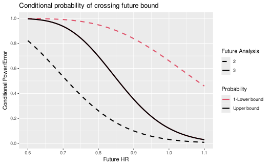

# Conditional power and conditional error

## Introduction

We provide a simple plot of conditional power at the time of interim
analysis. While group sequential boundaries should be designed to be the
primary decision boundaries, conditional power evaluations can be useful
supportive information. In addition to conditional power, we provide a
predictive power estimate that averages conditional power based on a
flat prior updated using an interim analysis result.

## Design

We consider the default design from
[`gsSurv()`](https://keaven.github.io/gsDesign/reference/nSurv.md), only
altering the targeted hazard ratio to `hr = 0.7`, trial duration of
`T = 36` and minimum follow-up of `minfup = 24`. This implies expected
enrollment duration of 12 months at a constant rate. We note that the
expected interim analysis timing leaves enough time for a data
monitoring committee (DMC) to review and make recommendations to the
trial sponsor between analyses. We use the
[`toInteger()`](https://keaven.github.io/gsDesign/reference/toInteger.md)
function to round sample size and event counts to appropriate integers
resulting in a slightly larger power (90.05% versus the targeted 90%)
and slightly altered interim timing (117/353 = 0.3314, 235/353 = 0.6657)
compared to plan (0.3333, 0.6667).

``` r
design <- gsSurv(hr = 0.7, lambdaC = log(2) / 12, minfup = 24, T = 36) |> toInteger()
design |> gsBoundSummary()
#>     Analysis              Value Efficacy Futility
#>    IA 1: 33%                  Z   3.0139  -0.2451
#>       N: 466        p (1-sided)   0.0013   0.5968
#>  Events: 117       ~HR at bound   0.5728   1.0464
#>    Month: 12   P(Cross) if HR=1   0.0013   0.4032
#>              P(Cross) if HR=0.7   0.1398   0.0147
#>    IA 2: 67%                  Z   2.5478   0.9413
#>       N: 466        p (1-sided)   0.0054   0.1733
#>  Events: 235       ~HR at bound   0.7172   0.8844
#>    Month: 21   P(Cross) if HR=1   0.0062   0.8347
#>              P(Cross) if HR=0.7   0.5814   0.0436
#>        Final                  Z   1.9991   1.9991
#>       N: 466        p (1-sided)   0.0228   0.0228
#>  Events: 353       ~HR at bound   0.8083   0.8083
#>    Month: 36   P(Cross) if HR=1   0.0233   0.9767
#>              P(Cross) if HR=0.7   0.9005   0.0995
```

We also provide a textual summary.

``` r
cat(design |> summary())
```

Asymmetric two-sided group sequential design with non-binding futility
bound, 3 analyses, time-to-event outcome with sample size 466 and 353
events required, 90 percent power, 2.5 percent (1-sided) Type I error to
detect a hazard ratio of 0.7. Enrollment and total study durations are
assumed to be 12 and 36.1 months, respectively. Efficacy bounds derived
using a Hwang-Shih-DeCani spending function with gamma = -4. Futility
bounds derived using a Hwang-Shih-DeCani spending function with gamma =
-2.

## Update design at time of interim analysis

Assume when the first interim is performed, there are 125 instead of the
planned 117 endpoints included in the analysis. We update the bounds as
follows:

``` r
update <- gsDesign(
  k = design$k,
  test.type = design$test.type,
  alpha = design$alpha,
  beta = design$beta,
  sfu = design$upper$sf,
  sfupar = design$upper$param,
  sfl = design$lower$sf,
  sflpar = design$lower$param,
  n.I = c(117, design$n.I[2:3]),
  maxn.IPlan = design$n.I[design$k],
  delta = design$delta,
  delta1 = design$delta1,
  delta0 = design$delta0
)
gsBoundSummary(
  update,
  deltaname = "HR",
  logdelta = TRUE,
  Nname = "Events",
  digits = 4,
  ddigits = 2,
  tdigits = 1,
  exclude = c(
    "B-value", "CP", "CP H1", "PP",
    paste0("P(Cross) if HR=", round(c(design$hr0, design$hr), digits = 2))
  )
)
#>     Analysis        Value Efficacy Futility
#>    IA 1: 33%            Z   3.0139  -0.2451
#>  Events: 117  p (1-sided)   0.0013   0.5968
#>              ~HR at bound   0.5728   1.0464
#>                  Spending   0.0013   0.0147
#>    IA 2: 67%            Z   2.5478   0.9413
#>  Events: 235  p (1-sided)   0.0054   0.1733
#>              ~HR at bound   0.7172   0.8844
#>                  Spending   0.0049   0.0289
#>        Final            Z   1.9991   1.9991
#>  Events: 353  p (1-sided)   0.0228   0.0228
#>              ~HR at bound   0.8083   0.8083
#>                  Spending   0.0188   0.0564
```

## Testing and conditional power

We assume an interim p-value of 0.04, one-sided. This does not come
close to the first efficacy or futility bound above. However, it is a
trend in the right direction.

``` r
# Nominal 1-sided p-value
p <- 0.04
```

This translates to a first order approximation of the Cox regression
estimate with the Schoenfeld (1981) approximation:

``` r
zn2hr(-qnorm(p), n = update$n.I[1])
#> [1] 0.7234658
```

Typically, conditional power is reported based on 3 different
assumptions about the future treatment effect:

1.  The observed HR; here we base this on the above approximation.
2.  No treatment effect; this translates to conditional error.
3.  The originally targeted treatment effect in the design.

These are displayed below, translated to the hazard ratio scale:

``` r
cp <- gsCP(x = update, i = 1, zi = -qnorm(p))
# 3 treatment effects as outlined above
# design$ratio is the experimental:control randomization ratio
exp(-cp$theta * sqrt((1 + design$ratio)^2 / design$ratio))
#> [1] 0.7234658 1.0000000 0.6995487
```

Now we display the probability of crossing an efficacy boundary before a
futility boundary conditional on the above observed p-value at the first
interim analysis from the above call to
[`gsCP()`](https://keaven.github.io/gsDesign/reference/gsCP.md). The
columns of the resulting matrix correspond to the above treatment
effects. The rows correspond to the second interim and final analyses.
Adding the numbers in the first column, we get a conditional power of
0.899 for the treatment effect observed at the first interim. The third
column yields a conditional power of 0.937 for the originally targeted
hazard ratio of 0.7. Finally, the second column yields a conditional
error under the assumption of a future hazard ratio of 1 (no underlying
treatment effect) of 0.121. This could be used with the conditional
error method of Müller and Schäfer (2004) to adapt the design for
endpoints other than the time-to-event example used here (e.g., a binary
outcome).

``` r
cp$upper$prob
#>           [,1]       [,2]      [,3]
#> [1,] 0.4625266 0.03199697 0.5352688
#> [2,] 0.4364291 0.08886339 0.4017165
```

We demonstrate a conditional power plot that may be of some use. We will
assume a wide range of potential underlying hazard ratios for future
events.

``` r
hr <- seq(.6, 1.1, .01)
```

We compute conditional probabilities based on the observed interim 1
p-value over this range:

``` r
# Translate hazard ratio to standardized effect size
theta <- -log(hr) * sqrt(design$ratio / (1 + design$ratio)^2)
cp <- gsCP(x = update, i = 1, zi = -qnorm(p), theta = theta)
```

Finally, we plot conditional power as a function of future HR. Note the
use of the power plot option for the **gsDesign** plot function. The
`offset = 1` argument changes the legend to be labeled with “Future
Analysis” 2 and 3. The solid black line shows the conditional
probability of crossing any future bound prior to crossing a lower
bound. In general, black lines on this plot will show the cumulative
conditional probability of crossing an efficacy bound prior to crossing
a lower bound by the time of any given future analysis by different
underlying treatment effect assumptions. The red lines show 1 minus the
cumulative conditional probability of crossing a lower bound prior to
crossing an efficacy bound by any given future analysis by different
underlying treatment effect (HR) assumptions.

``` r
plot(cp, xval = hr, xlab = "Future HR", ylab = "Conditional Power/Error", 
     main="Conditional probability of crossing future bound", offset = 1)
```



## Predictive power

Assuming a flat prior distribution and a constant treatment underlying
treatment effect throughout the trial, we can compute a Bayesian
predictive power conditioning on the interim \\p\\-value above. This
takes into account the uncertainty of the underlying treatment effect,
updating the flat prior based on the interim result and using the
resulting posterior distribution to average across total conditional
probabilities from the conditional power plot above. This provides a
single number to summarize the conditional probability of success given
the interim result.

``` r
# set up a flat prior distribution for the treatment effect
# that is normal with mean .5 of the design standardized effect and
# a large standard deviation. 
mu0 <- .5 * design$delta 
sigma0 <- design$delta * 2
prior <- normalGrid(mu = mu0, sigma = sigma0)
gsPP(x = update, i = 1, zi = -qnorm(p), theta = prior$z, wgts = prior$wgts)
#> [1] 0.7631346
```

While the conditional power based on the observed effect was essentially
90%, we now have an estimate that effectively shrinks towards a lesser
effect based on the uncertainly of the observed treatment effect. The
predictive probability is similar whether `mu0` above is `0` or
`design$delta`.

## References

Müller, Hans-Helge, and Helmut Schäfer. 2004. “A General Statistical
Principle for Changing a Design Any Time During the Course of a Trial.”
*Statistics in Medicine* 23 (16): 2497–2508.

Schoenfeld, David. 1981. “The Asymptotic Properties of Nonparametric
Tests for Comparing Survival Distributions.” *Biometrika* 68 (1):
316–19.
