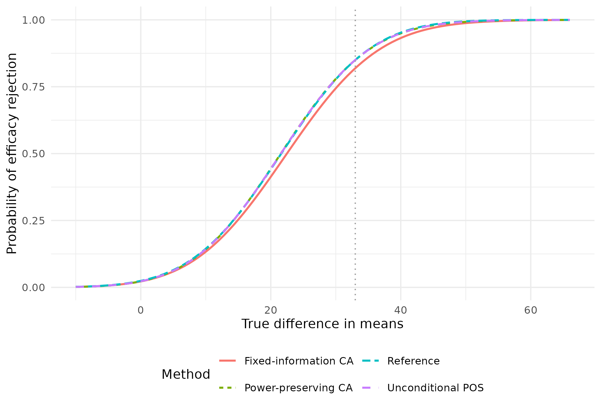
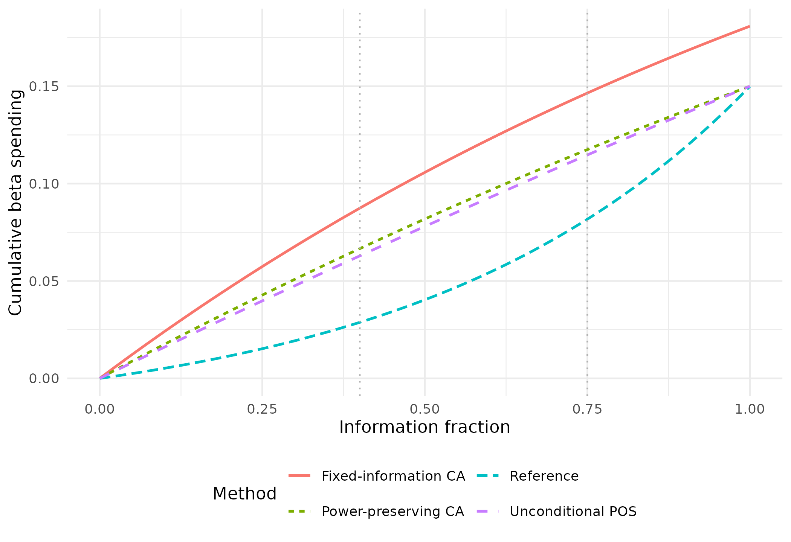

# Futility spending calibrated to assurance and probability of success

``` r

library(gsDesign)
library(ggplot2)
```

The functions in this vignette translate probability-of-success
requirements into **futility spending functions**. They build on
established computational tools in gsDesign: boundary construction,
joint crossing probabilities, and prior-averaged probabilities. The new
work is calibration of the spending parameters, not replacement of the
underlying group sequential calculations.

Three related questions lead to three different designs:

| Function | Probability targeted | What stays fixed? | What may change? |
|:---|:---|:---|:---|
| `gsCPOSFutilitySpending(mode = "preserve_power")` | Conditional POS at selected interims | Planned frequentist power and relative timing | Maximum information |
| `gsCPOSFutilitySpending(mode = "fixed_information")` | Conditional POS at selected interims | Information and efficacy boundaries | Overall power/beta |
| [`gsPOSFutilitySpending()`](https://keaven.github.io/gsDesign/reference/gsPOSFutilitySpending.md) | Unconditional POS for the whole design | Planned frequentist power and relative timing | Maximum information |

All three return a spending family and fitted parameter set, a complete
design, and diagnostics. They differ from
[`gsCPFutilitySpending()`](https://keaven.github.io/gsDesign/reference/gsCPFutilitySpending.md)
and
[`gsPPFutilitySpending()`](https://keaven.github.io/gsDesign/reference/gsPPFutilitySpending.md),
which target probabilities at an exact interim futility bound. Those
methods are described in the [conditional-power
vignette](https://keaven.github.io/gsDesign/articles/CPFutilitySpending.md).

## What is conditioned on?

Let \\C_i\\ mean that the trial has crossed neither stopping boundary
through interim \\i\\, and let \\E\_{\>i}\\ mean a later efficacy
rejection. Conditional assurance is

\\ \Pr(E\_{\>i}\mid C_i) = \frac{\Pr(E\_{\>i}\cap C_i)}{\Pr(C_i)}. \\

Both probabilities average over the prespecified effect prior.
Conditioning on continuation implicitly changes the relative
plausibility of the possible effects. This is the quantity calculated by
[`gsCPOS()`](https://keaven.github.io/gsDesign/reference/gsCP.md),
including the full earlier stopping history.

In contrast,
[`gsPOS()`](https://keaven.github.io/gsDesign/reference/gsCP.md) is the
probability of any efficacy rejection before seeing data; it includes
early efficacy.
[`gsPP()`](https://keaven.github.io/gsDesign/reference/gsCP.md)
conditions on a particular interim statistic and averages future success
over its posterior effect distribution. Thus conditional assurance is
**not PP at the futility bound**. A high assurance among trials allowed
to continue does not say that a trial just at the boundary has high
predictive power.

Without early efficacy, conditional assurance is POS divided by the
prior probability of continuation. With early efficacy, its numerator
must exclude those earlier successes. A point prior changes the
averaging, but not this distinction between a continuation event and an
exact observed statistic.

## A Dragalin-related fixed-information example

Dragalin’s *Informative Futility Rules Based on Conditional Assurance*
motivates comparing assurance among continuing trials with the assurance
of a larger, feasible fixed design. Here we use the paper’s
normal-outcome setting: interim sample size 72, maximum sample size 144,
equal allocation, common standard deviation 70, and an effect prior
\\N(33,16^2)\\. These are total sample sizes across both treatment
groups.

For a difference of normal means with equal allocation, the standardized
effect is the mean difference divided by \\2\\SD=140\\. We use that
scale throughout. This is the paper’s informative prior, **not** the
broader default prior in
[`gsBoundSummary()`](https://keaven.github.io/gsDesign/reference/gsBoundSummary.md).
We supply it explicitly to every prior-based calculation.

``` r

effect_sd <- 70
effect_h1 <- 33
prior <- normalGrid(mu = effect_h1 / (2 * effect_sd),
                    sigma = 16 / (2 * effect_sd))
prior$wgts <- prior$wgts / sum(prior$wgts)

reference <- gsDesign(
  k = 2, test.type = 4, delta = effect_h1 / (2 * effect_sd),
  n.I = c(72, 144), maxn.IPlan = 144,
  testUpper = c(FALSE, TRUE), sfl = sfHSD, sflpar = 0, r = 32
)
```

The benchmark has a single final analysis at \\N=230\\ and one-sided
alpha 0.025. Since
[`gsDesign()`](https://keaven.github.io/gsDesign/reference/gsDesign.md)
constructs sequential designs, we specify the one-look boundaries
directly for probability evaluation. Both terminal bounds are the same:
every trial has a final decision.

``` r

fixed_benchmark <- structure(
  list(k = 1L, test.type = 4L, n.I = 230,
       upper = list(bound = qnorm(.975)),
       lower = list(bound = qnorm(.975)), r = 32L, overrun = 0),
  class = "gsDesign"
)
benchmark <- gsPOS(fixed_benchmark, theta = prior$z, wgts = prior$wgts)
benchmark
#> [1] 0.7901662
```

Compute this benchmark **once**, not again from each candidate design.

``` r

fit_dragalin <- gsCPOSFutilitySpending(
  reference, target_cpos = benchmark, i = 1, prior = prior,
  mode = "fixed_information"
)
dragalin_results <- c(
  Target_assurance = benchmark,
  Achieved_assurance = gsCPOS(1, fit_dragalin, prior$z, prior$wgts),
  Interim_N = fit_dragalin$n.I[1],
  Final_N = fit_dragalin$n.I[2],
  Effect_at_futility = fit_dragalin$lower$bound[1] *
    2 * effect_sd / sqrt(fit_dragalin$n.I[1]),
  Overall_power_H1 = sum(fit_dragalin$upper$prob[, 2]),
  Fitted_beta = fit_dragalin$beta,
  Fitted_sflpar = fit_dragalin$cposFutilitySpending$sflpar
)
data.frame(Quantity = names(dragalin_results), Value = unname(dragalin_results)) |>
  knitr::kable(digits = 4)
```

| Quantity           |    Value |
|:-------------------|---------:|
| Target_assurance   |   0.7902 |
| Achieved_assurance |   0.7902 |
| Interim_N          |  72.0000 |
| Final_N            | 144.0000 |
| Effect_at_futility |   7.2740 |
| Overall_power_H1   |   0.7932 |
| Fitted_beta        |   0.2068 |
| Fitted_sflpar      |  -1.8139 |

The target is approximately 0.7902. Solving equality gives an effect
threshold of approximately 7.274, rather than the illustrative threshold
of 10 in the paper (which exceeds the benchmark). The sample sizes
remain 72 and 144; the achieved overall power at effect 33 is about
79.3%.

This is a spending-based implementation of the fixed-information
assurance criterion. It is **not** a reproduction of an entire
sample-size re-estimation procedure or an inverse-normal combination
test.

## Compare all three methods on the same reference

For a broader comparison, retain the same effect prior, SD and planned
effect, but use a reference with 85% power, information fractions 0.4
and 0.75, and one active futility analysis at the first interim. There
are efficacy analyses at all three looks. A single early futility
analysis is often sufficient; a one-parameter spending function can also
be adequate with additional futility looks after inspection of every
bound.

``` r

n_fixed <- nNormal(delta1 = effect_h1, sd = effect_sd, beta = .15)
x <- gsDesign(
  k = 3, test.type = 4, n.fix = n_fixed, beta = .15,
  timing = c(.4, .75), delta1 = effect_h1,
  sfu = sfLDOF, sfl = sfHSD, sflpar = -2,
  testLower = c(TRUE, FALSE, FALSE)
)
data.frame(Fixed_design_N = n_fixed, Sequential_reference_N = tail(x$n.I, 1)) |>
  knitr::kable(digits = 2)
```

| Fixed_design_N | Sequential_reference_N |
|---------------:|-----------------------:|
|         161.59 |                 168.87 |

### Same conditional assurance, different sample-size and power constraints

Both fits below target conditional assurance of 0.80 at the first
interim. This is a continuation-conditioned target, **not CP = 0.80 at a
boundary**. The package calls this conditional probability of success
(CPOS). Both fits use
[`gsCPOSFutilitySpending()`](https://keaven.github.io/gsDesign/reference/gsCPOSFutilitySpending.md),
with `mode` selecting the design constraint. `"preserve_power"` is the
default. Both modes use `control$cpos_tol` and return diagnostics in
`cposFutilitySpending`. The old
[`gsCAFutilitySpending()`](https://keaven.github.io/gsDesign/reference/gsCAFutilitySpending.md)
interface remains a compatibility wrapper for
`mode = "fixed_information"`.

``` r

fit_cpos <- gsCPOSFutilitySpending(x, target_cpos = .80, i = 1, prior = prior)
fit_ca <- gsCPOSFutilitySpending(x, target_cpos = .80, i = 1, prior = prior,
                               mode = "fixed_information")

stopifnot(identical(fit_ca$n.I, x$n.I),
          identical(fit_ca$upper$bound, x$upper$bound))
```

The first fit increases information to retain 85% power. The second
freezes the reference information and efficacy boundaries, allowing
power to fall. The fixed-information solver also determines total beta:
using the reference beta unchanged would generally not produce a
consistent spending rule at the fixed final efficacy boundary.

### Unconditional POS is a different requirement

POS is a single scalar for the whole design, so this interface fits one
free parameter and has no interim-index argument. It rejects an
unconstrained two-parameter family; one target cannot determine two
parameters uniquely.

``` r

fit_pos <- gsPOSFutilitySpending(
  x, target_pos = .7206, prior = prior,
  control = list(start = 0, lower = -2, upper = 2, pos_tol = 1e-7)
)
```

The precision here illustrates the solver, not a recommendation that
such small POS differences are practically important. For this prior,
preserving power while changing information largely offsets the effect
of changing the futility rule, leaving POS nearly unchanged. This can
make POS calibration weakly informative about spending shape. The
objective may also be nonmonotone: matching the target does not prove a
unique solution. A point prior at the planned alternative is an extreme
example, because POS then equals the power already being preserved.

### Verify with established probability calculations

These are fresh calculations from the returned bounds and information,
rather than just the optimizer’s reported residuals.

``` r

verification <- data.frame(
  Method = c("Power-preserving CA", "Fixed-information CA", "Unconditional POS"),
  Target = c(.80, .80, .7206),
  Achieved = c(gsCPOS(1, fit_cpos, prior$z, prior$wgts),
               gsCPOS(1, fit_ca, prior$z, prior$wgts),
               gsPOS(fit_pos, prior$z, prior$wgts))
)
knitr::kable(verification, digits = 6)
```

| Method               | Target | Achieved |
|:---------------------|-------:|---------:|
| Power-preserving CA  | 0.8000 |   0.8000 |
| Fixed-information CA | 0.8000 |   0.8000 |
| Unconditional POS    | 0.7206 |   0.7206 |

``` r

stopifnot(max(abs(verification$Achieved - verification$Target)) < 1e-4)

# Verify that total beta and the fitted lower spending agree.
desired_beta <- fit_ca$lower$sf(
  fit_ca$beta, fit_ca$lower$sTime, fit_ca$lower$param
)$spend
# At the inactive second futility look, spending is deferred.
desired_beta[2] <- desired_beta[1]
stopifnot(max(abs(cumsum(fit_ca$lower$prob[, 2]) - desired_beta)) < 1e-5)
```

For the power-preserving fit, replay the fitted spending parameter in an
ordinary
[`gsDesign()`](https://keaven.github.io/gsDesign/reference/gsDesign.md)
call with the complete reference specification:

``` r

replay <- gsDesign(
  k = 3, test.type = 4, n.fix = n_fixed, beta = .15,
  timing = c(.4, .75), delta1 = effect_h1,
  sfu = sfLDOF, sfl = sfHSD,
  sflpar = fit_cpos$cposFutilitySpending$sflpar,
  testLower = c(TRUE, FALSE, FALSE)
)
gsCPOS(1, replay, prior$z, prior$wgts)
#> [1] 0.8
```

For the fixed-information fit, replay with
`gsCPOSFutilitySpending(mode = "fixed_information")` and the original
reference, using the fitted free parameters as the start. An ordinary
power-preserving reconstruction is not equivalent.

## Operating characteristics, not just a target

``` r

designs <- list(Reference = x, "Power-preserving CA" = fit_cpos,
                "Fixed-information CA" = fit_ca, "Unconditional POS" = fit_pos)
operating <- do.call(rbind, lapply(names(designs), function(label) {
  d <- designs[[label]]
  p <- gsProbability(d = d, theta = c(0, x$delta))
  data.frame(
    Method = label, Max_N = tail(d$n.I, 1),
    Inflation_percent = 100 * (tail(d$n.I, 1) / n_fixed - 1),
    Actual_type_I = sum(p$upper$prob[, 1]),
    Power_H1 = sum(p$upper$prob[, 2]),
    POS = gsPOS(d, prior$z, prior$wgts),
    CA_at_IA1 = gsCPOS(1, d, prior$z, prior$wgts),
    Futility_H0 = sum(p$lower$prob[-d$k, 1]),
    Futility_H1 = sum(p$lower$prob[-d$k, 2]),
    EN_H0 = p$en[1], EN_H1 = p$en[2]
  )
}))
knitr::kable(operating[c("Method", "Max_N", "Inflation_percent",
                        "Actual_type_I", "Power_H1")], digits = 4)
```

| Method               |    Max_N | Inflation_percent | Actual_type_I | Power_H1 |
|:---------------------|---------:|------------------:|--------------:|---------:|
| Reference            | 168.8726 |            4.5038 |        0.0243 |   0.8500 |
| Power-preserving CA  | 180.7590 |           11.8595 |        0.0226 |   0.8500 |
| Fixed-information CA | 168.8726 |            4.5038 |        0.0222 |   0.8192 |
| Unconditional POS    | 179.2358 |           10.9169 |        0.0228 |   0.8500 |

``` r

knitr::kable(operating[c("Method", "POS", "CA_at_IA1",
                        "Futility_H0", "Futility_H1")], digits = 4)
```

| Method               |    POS | CA_at_IA1 | Futility_H0 | Futility_H1 |
|:---------------------|-------:|----------:|------------:|------------:|
| Reference            | 0.7210 |    0.7444 |      0.5152 |      0.0288 |
| Power-preserving CA  | 0.7206 |    0.8000 |      0.6925 |      0.0666 |
| Fixed-information CA | 0.7010 |    0.8000 |      0.7192 |      0.0874 |
| Unconditional POS    | 0.7206 |    0.7947 |      0.6790 |      0.0629 |

``` r

knitr::kable(operating[c("Method", "EN_H0", "EN_H1")], digits = 2)
```

| Method               |  EN_H0 |  EN_H1 |
|:---------------------|-------:|-------:|
| Reference            | 116.24 | 135.14 |
| Power-preserving CA  | 105.20 | 138.56 |
| Fixed-information CA |  95.58 | 129.47 |
| Unconditional POS    | 105.76 | 138.04 |

The fixed design requires about 161.6 participants. Sample sizes are
continuous planning values; rounding requires another check of the
resulting operating characteristics and target probabilities. The
inflation column uses that fixed design, not the sequential reference,
as its denominator. Much of the inflation in these examples is the cost
of preserving power despite futility stopping. A practical maximum, such
as 20% inflation, should be considered alongside the probability target;
none of these functions automatically enforces such a cap.

For nonbinding futility, the nominal efficacy-only alpha remains 0.025,
while actual type I error with futility enforced may be smaller. With a
binding reference (`test.type = 3`), freezing efficacy while changing
futility can increase actual type I error above the reference alpha. The
fixed-information method reports that probability; it does not guarantee
alpha preservation.

``` r

effect <- seq(-10, 66, length.out = 101)
curves <- do.call(rbind, lapply(names(designs), function(label) {
  p <- gsProbability(d = designs[[label]], theta = effect / (2 * effect_sd))
  data.frame(Effect = effect, Power = colSums(p$upper$prob), Method = label)
}))
ggplot(curves, aes(Effect, Power, colour = Method, linetype = Method)) +
  geom_line(linewidth = .8) +
  geom_vline(xintercept = effect_h1, colour = "grey60", linetype = 3) +
  labs(x = "True difference in means", y = "Probability of efficacy rejection") +
  theme_minimal() + theme(legend.position = "bottom") +
  guides(colour = guide_legend(nrow = 2), linetype = guide_legend(nrow = 2))
```



### Sample sizes and approximate effects at all bounds

A probability target is not a substitute for judging whether the effect
at a futility boundary is clinically reasonable. Approximate mean
differences below are \\Z \times 2\\SD/\sqrt{N}\\; they are
normal-theory approximations, not bias-adjusted sequential estimates.
Inactive futility analyses have no reported futility effect.

``` r

bounds <- do.call(rbind, lapply(names(designs), function(label) {
  d <- designs[[label]]
  lower_effect <- d$lower$bound * 2 * effect_sd / sqrt(d$n.I)
  lower_effect[!d$testLower] <- NA_real_
  data.frame(Method = label, Analysis = seq_len(d$k), N = d$n.I,
             Efficacy_effect = d$upper$bound * 2 * effect_sd / sqrt(d$n.I),
             Futility_effect = lower_effect)
}))
knitr::kable(bounds, digits = 3)
```

| Method               | Analysis |       N | Efficacy_effect | Futility_effect |
|:---------------------|---------:|--------:|----------------:|----------------:|
| Reference            |        1 |  67.549 |          57.181 |           0.650 |
| Reference            |        2 | 126.654 |          29.170 |              NA |
| Reference            |        3 | 168.873 |          21.681 |              NA |
| Power-preserving CA  |        1 |  72.304 |          55.269 |           8.280 |
| Power-preserving CA  |        2 | 135.569 |          28.195 |              NA |
| Power-preserving CA  |        3 | 180.759 |          20.956 |              NA |
| Fixed-information CA |        1 |  67.549 |          57.181 |           9.886 |
| Fixed-information CA |        2 | 126.654 |          29.170 |              NA |
| Fixed-information CA |        3 | 168.873 |          21.681 |              NA |
| Unconditional POS    |        1 |  71.694 |          55.503 |           7.688 |
| Unconditional POS    |        2 | 134.427 |          28.315 |              NA |
| Unconditional POS    |        3 | 179.236 |          21.045 |              NA |

The standard summary adds CP, CP H1 and PP at the bounds. The prior here
remains the explicit Dragalin prior. Those bound-based quantities should
not be mistaken for the continuation-conditioned targets above.

``` r

gsBoundSummary(fit_ca, prior = prior, exclude = "B-value", digits = 4)
#>   Analysis                Value Efficacy Futility
#>  IA 1: 40%                    Z   3.3569   0.5803
#>      N: 68          p (1-sided)   0.0004   0.2808
#>                 ~delta at bound  57.1812   9.8856
#>                        Spending   0.0004   0.0874
#>                              CP   1.0000   0.0811
#>                           CP H1   0.9964   0.6017
#>                              PP   0.9966   0.3454
#>             P(Cross) if delta=0   0.0004   0.7192
#>            P(Cross) if delta=33   0.0779   0.0874
#>  IA 2: 75%                    Z   2.3449       NA
#>     N: 127          p (1-sided)   0.0095       NA
#>                 ~delta at bound  29.1705       NA
#>                        Spending   0.0093       NA
#>                              CP   0.9178       NA
#>                           CP H1   0.9416       NA
#>                              PP   0.9076       NA
#>             P(Cross) if delta=0   0.0094       NA
#>            P(Cross) if delta=33   0.6145       NA
#>      Final                    Z   2.0125       NA
#>     N: 169          p (1-sided)   0.0221       NA
#>                 ~delta at bound  21.6812       NA
#>                        Spending   0.0154       NA
#>             P(Cross) if delta=0   0.0222       NA
#>            P(Cross) if delta=33   0.8192       NA
```

Here CP at the futility bound is about 0.081 and PP is about 0.345, even
though conditional assurance among continuing trials is 0.80. This
concrete contrast is why the conditioning event needs to be stated
whenever a target is quoted.

## The final specification is still a spending function

``` r

times <- seq(0, 1, length.out = 301)
spending <- do.call(rbind, lapply(names(designs), function(label) {
  d <- designs[[label]]
  data.frame(Time = times, Spend = d$lower$sf(d$beta, times, d$lower$param)$spend,
             Method = label)
}))
ggplot(spending, aes(Time, Spend, colour = Method, linetype = Method)) +
  geom_line(linewidth = .8) +
  geom_vline(xintercept = c(.4, .75), colour = "grey70", linetype = 3) +
  labs(x = "Information fraction", y = "Cumulative beta spending") +
  theme_minimal() + theme(legend.position = "bottom") +
  guides(colour = guide_legend(nrow = 2), linetype = guide_legend(nrow = 2))
```



These curves need not cross at the calibration time: the target is
conditional assurance or POS, not cumulative beta spending. The
fixed-information design can also have a different total beta. The
curves describe the spending family; actual spending is deferred at
inactive futility analyses.

Spending functions retain the original motivation of the Lan–DeMets
approach: the specification can accommodate different information times
and, under an appropriate monitoring plan, a different number of
analyses. They provide a continuous rule between planned looks, a
compact reproducible specification, and a framework for recalculating
boundaries while respecting spending already used. This flexibility is
particularly useful when actual information accrues differently from the
original plan.

It does **not** mean that one should refit parameters freely after
seeing treatment effects, or that changing the monitoring schedule
preserves the original assurance target or power exactly. Re-evaluate
the resulting design and its operating characteristics. Timing changes
informed by unblinded outcomes need additional justification.

## Building on established computational tools with AI

The calibration framework builds on existing gsDesign tools rather than
new probability-integration machinery. Most of the initial CP/PP
development was done interactively with AI using **GPT-6 Astra High in
Codex over a long weekend**. The later assurance extensions follow the
same principle: rapidly build new design interfaces on established
computational tools.

Validation need not rest solely on line-by-line inspection of generated
code. Reconstruct fitted designs and check their properties with
[`gsDesign()`](https://keaven.github.io/gsDesign/reference/gsDesign.md),
[`gsProbability()`](https://keaven.github.io/gsDesign/reference/gsProbability.md),
[`gsCPOS()`](https://keaven.github.io/gsDesign/reference/gsCP.md),
[`gsPOS()`](https://keaven.github.io/gsDesign/reference/gsCP.md) and
[`gsBoundSummary()`](https://keaven.github.io/gsDesign/reference/gsBoundSummary.md).
Unit tests also check independent bivariate-normal integration, the
numerical Dragalin benchmark, parameter replay, input errors and
numerical failure handling. These checks support the statistical
results; they do not establish that every possible software defect has
been excluded.

## Scope and practical limits

- Current assurance/POS calibration supports fixed-timing statistical
  `gsDesign` objects with test types 3 and 4, not direct survival
  objects.
- Harm-bound designs are excluded: current
  [`gsCPOS()`](https://keaven.github.io/gsDesign/reference/gsCP.md) does
  not include harm stopping in its continuation denominator.
- Conditional-assurance fits support the existing one-/two-parameter
  families and piecewise linear spending, with one target per free
  parameter.
- POS has only one design-wide target and fits one free parameter.
- Prior weights are normalized, and the prior is fixed throughout
  calibration. Continuation probabilities at or below
  `sqrt(.Machine$double.eps)` are rejected for conditional assurance.
- A failed numerical search is not a proof of mathematical
  infeasibility. A matched target is not proof that the design is
  clinically attractive.
- Review overall power, actual type I error, expected and maximum sample
  size, stopping probabilities, effect sizes at bounds, and sensitivity
  to the prior and monitoring schedule before choosing a design.

## References

Dragalin V. *Informative Futility Rules Based on Conditional Assurance*.
Statistics in Medicine (2026).
[doi:10.1002/sim.70330](https://doi.org/10.1002/sim.70330).

Lan KKG, DeMets DL. *Discrete sequential boundaries for clinical
trials*. Biometrika (1983), 70:659–663.
[doi:10.1093/biomet/70.3.659](https://doi.org/10.1093/biomet/70.3.659).
