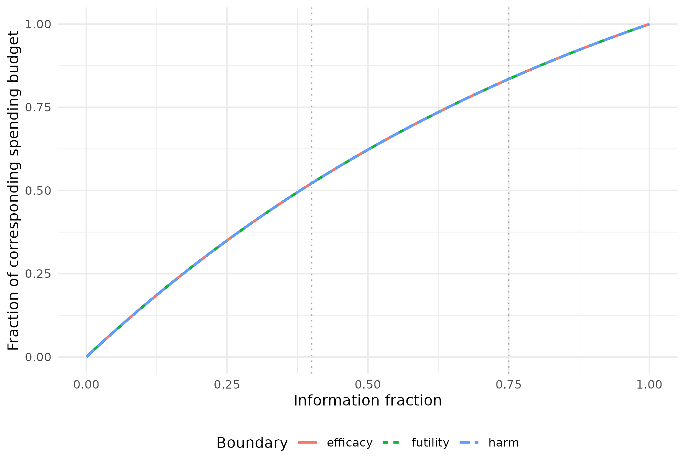

# Calibrating spending to effects at interim bounds

``` r

library(gsDesign)
library(ggplot2)
```

## Specify an effect; retain a spending function

**gsEffectSpending()** selects spending parameters so that approximate
observed treatment effects at specified interim efficacy, futility or
harm bounds match natural-scale targets. A single function supports one
boundary or a joint fit. It builds on the established gsDesign boundary
and probability calculations.

This answers a different question from CP, PP or conditional assurance:
“What observed treatment effect should correspond to this stopping
boundary?” The result still specifies spending functions, rather than
only isolated boundary values. Planned power and nominal error budgets
are retained by recalculating information. Maximum sample size may
therefore change.

Effects at bounds are normal-theory approximations, not bias-adjusted
sequential estimates. The candidate’s information must be used in each
transformation. A target cannot generally be converted to a fixed Z
boundary once, using the original sample size.

## Joint efficacy, futility and harm targets for normal means

Consider equal allocation, a common standard deviation of 1, and an
alternative mean difference of 0.2. Positive differences favor the
experimental treatment. Information fractions are 0.4 and 0.75, with 90%
power and nonbinding futility/harm (test type 8).

``` r

n_fixed <- nNormal(delta1 = .2, sd = 1)
x <- gsDesign(
  k = 3, test.type = 8, n.fix = n_fixed, delta1 = .2,
  timing = c(.4, .75), sfu = sfHSD, sfupar = 0,
  sfl = sfHSD, sflpar = 0, sfharm = sfHSD, sfharmparam = 0,
  astar = .05
)
n_fixed
#> [1] 1050.742
```

The following targets were chosen near a known feasible configuration to
illustrate joint calibration, not as clinical recommendations. Specify
them directly as differences in means, not as Z values or standardized
effects.

``` r

fit <- gsEffectSpending(
  x,
  target_effect = c(.185346, .064696, -.161755),
  i = c(1, 1, 1),
  bound = c("efficacy", "futility", "harm"),
  spending = list(efficacy = sfHSD, futility = sfHSD, harm = sfHSD),
  effect = list(endpoint = "mean_difference"),
  control = list(effect_tol = 1e-5)
)
knitr::kable(fit$effectSpending$targets, digits = 6)
```

| bound    |   i | target_effect | achieved_effect | residual |
|:---------|----:|--------------:|----------------:|---------:|
| efficacy |   1 |      0.185346 |        0.185346 |        0 |
| futility |   1 |      0.064696 |        0.064696 |        0 |
| harm     |   1 |     -0.161755 |       -0.161755 |        0 |

``` r

fit$effectSpending$free_parameters
#> $efficacy
#> [1] 0.9999656
#> 
#> $futility
#> [1] 1
#> 
#> $harm
#> [1] 1.000015
```

Efficacy requires evidence of benefit; futility stops for an
insufficiently promising result; harm is further in the unfavorable
direction. These are three targets on the **same endpoint scale**. Their
numerical values and clinical interpretation must be assessed together.

Fitting one boundary and then another need not preserve the first match:
information and boundaries are coupled. The joint fit checks all
requested effects simultaneously.

### Independent reconstruction and verification

``` r

replay <- do.call(gsDesign, fit$effectSpending$replay)
achieved <- gsDelta(
  c(replay$upper$bound[1], replay$lower$bound[1], replay$harm$bound[1]),
  i = c(1, 1, 1), x = replay
)
stopifnot(max(abs(achieved - fit$effectSpending$targets$target_effect)) < 1e-5)

p <- gsProbability(d = replay, theta = c(0, replay$delta))
knitr::kable(data.frame(
  Quantity = c("Fixed-design N", "Reference maximum N", "Fitted maximum N",
               "Inflation over fixed design (%)", "Actual type I error",
               "Power at planned alternative"),
  Value = c(n_fixed, tail(x$n.I, 1), tail(replay$n.I, 1),
            100 * (tail(replay$n.I, 1) / n_fixed - 1),
            sum(p$upper$prob[, 1]), sum(p$upper$prob[, 2]))
), digits = 4)
```

| Quantity                        |     Value |
|:--------------------------------|----------:|
| Fixed-design N                  | 1050.7423 |
| Reference maximum N             | 1321.2665 |
| Fitted maximum N                | 1441.1783 |
| Inflation over fixed design (%) |   37.1581 |
| Actual type I error             |    0.0225 |
| Power at planned alternative    |    0.9000 |

Actual type I error with lower stopping enforced can differ from the
nominal efficacy budget. Check the design’s binding/nonbinding
conventions, not merely its stored alpha. A successful effect match also
does not establish that its sample-size inflation is acceptable; a
practical limit such as 20% over a fixed design may be part of design
selection.

Sample sizes here are continuous planning values. After rounding,
recheck effects and operating characteristics.

### All bounds, not only the targeted interim

``` r

bounds <- data.frame(
  Analysis = seq_len(replay$k), N = replay$n.I,
  Efficacy_effect = gsDelta(replay$upper$bound, seq_len(replay$k), replay),
  Futility_effect = gsDelta(replay$lower$bound, seq_len(replay$k), replay),
  Harm_effect = gsDelta(replay$harm$bound, seq_len(replay$k), replay)
)
knitr::kable(bounds, digits = 4)
```

| Analysis |         N | Efficacy_effect | Futility_effect | Harm_effect |
|---------:|----------:|----------------:|----------------:|------------:|
|        1 |  576.4713 |          0.1853 |          0.0647 |     -0.1618 |
|        2 | 1080.8837 |          0.1380 |          0.1037 |     -0.1194 |
|        3 | 1441.1783 |          0.1231 |          0.1231 |     -0.1063 |

``` r

gsBoundSummary(replay, exclude = "B-value", digits = 4)
#>   Analysis                 Value    Harm Futility Efficacy
#>  IA 1: 40%                     Z -1.9419   0.7767   2.2251
#>     N: 577           p (1-sided)  0.9739   0.2187   0.0130
#>                  ~delta at bound -0.1618   0.0647   0.1853
#>                         Spending  0.0261   0.0522   0.0130
#>                               CP  0.0000   0.0724   0.9473
#>                            CP H1  0.0071   0.6380   0.9654
#>                               PP  0.0000   0.1656   0.8585
#>              P(Cross) if delta=0  0.0261   0.7552   0.0130
#>            P(Cross) if delta=0.2  0.0000   0.0521   0.5698
#>  IA 2: 75%                     Z -1.9622   1.7051   2.2688
#>    N: 1081           p (1-sided)  0.9751   0.0441   0.0116
#>                  ~delta at bound -0.1194   0.1037   0.1380
#>                         Spending  0.0157   0.0313   0.0078
#>                               CP  0.0000   0.2315   0.7150
#>                            CP H1  0.0000   0.5714   0.8762
#>                               PP  0.0000   0.2622   0.6877
#>              P(Cross) if delta=0  0.0261   0.9310   0.0202
#>            P(Cross) if delta=0.2  0.0000   0.0835   0.8480
#>      Final                     Z -2.0185   2.3358   2.3358
#>    N: 1442           p (1-sided)  0.9782   0.0098   0.0098
#>                  ~delta at bound -0.1063   0.1231   0.1231
#>                         Spending  0.0083   0.0165   0.0041
#>              P(Cross) if delta=0  0.0261   0.9514   0.0225
#>            P(Cross) if delta=0.2  0.0000   0.1000   0.9000
```

CP, CP H1 and PP in the summary give additional perspectives on these
boundaries; none was directly targeted. The default PP prior is the
broad normal prior used by gsBoundSummary(), centered halfway between
the null and planned alternative on the standardized-effect scale.

## Compare the fitted spending shapes

The three spending budgets have different interpretations and totals.
The graph uses fractions of each budget to compare **shape**, not to
imply that alpha, beta and harm probabilities are interchangeable.

``` r

times <- seq(0, 1, length.out = 201)
slots <- c(efficacy = "upper", futility = "lower", harm = "harm")
budget <- c(efficacy = replay$alpha, futility = replay$beta, harm = replay$astar)
curves <- do.call(rbind, lapply(names(slots), function(b) {
  s <- replay[[slots[[b]]]]
  data.frame(Time = times,
             Fraction = s$sf(budget[b], times, s$param)$spend / budget[b],
             Boundary = b)
}))
ggplot(curves, aes(Time, Fraction, colour = Boundary, linetype = Boundary)) +
  geom_line(linewidth = .9) +
  geom_vline(xintercept = c(.4, .75), linetype = 3, colour = "grey65") +
  labs(x = "Information fraction", y = "Fraction of corresponding spending budget") +
  theme_minimal() + theme(legend.position = "bottom")
```



These illustrative targets are close to the same HSD shape for all three
boundaries, so the normalized curves nearly coincide. Other clinical
targets can produce different shapes.

Spending functions retain their usefulness when information accrues at
different times or the monitoring plan changes. Preserve spending
already used and reevaluate the revised design: the original effect
targets and power are not guaranteed to remain exact. This flexibility
does not authorize unrestricted refitting after observing unblinded
results.

## Two-parameter futility spending for a risk difference

For a response endpoint, let the control response probability be 0.1 and
experimental response probability 0.2. The alternative risk difference
is 0.1. nBinomial() supplies the fixed sample size; delta0 and delta1
define the natural-scale interpretation.

``` r

n_binomial <- nBinomial(p1 = .1, p2 = .2)
rd <- gsDesign(
  k = 3, test.type = 4, timing = c(.4, .75),
  n.fix = n_binomial, delta0 = 0, delta1 = .1,
  sfl = sfLogistic, sflpar = c(0, 1)
)
# Use attainable reference effects to demonstrate parameter recovery.
rd_targets <- gsDelta(rd$lower$bound[1:2], 1:2, rd)
rd_fit <- gsEffectSpending(
  rd, rd_targets, i = 1:2, spending = sfLogistic,
  effect = list(endpoint = "risk_difference"),
  control = list(start = c(-.1, 1.1))
)
knitr::kable(rd_fit$effectSpending$targets, digits = 5)
```

| bound    |   i | target_effect | achieved_effect | residual |
|:---------|----:|--------------:|----------------:|---------:|
| futility |   1 |       0.02122 |         0.02122 |        0 |
| futility |   2 |       0.04724 |         0.04724 |        0 |

``` r

knitr::kable(data.frame(
  Fixed_N = n_binomial, Maximum_N = tail(rd_fit$n.I, 1),
  Inflation_percent = 100 * (tail(rd_fit$n.I, 1) / n_binomial - 1)
), digits = 2)
```

| Fixed_N | Maximum_N | Inflation_percent |
|--------:|----------:|------------------:|
|  531.71 |    624.73 |             17.49 |

One target per free parameter is required for each selected family.
Piecewise linear spending is also supported, with knots fixed at the
selected spending times. Equal numbers of parameters and targets do not
prove uniqueness.

The risk-difference mapping is approximate: it does not identify an
exact observed 2-by-2 table. Invalid risk-difference targets are
rejected, and out-of-range achieved approximations are not silently
clipped.

## Hazard ratios require explicit event-scale metadata

An HR transformation must distinguish event information from patient
sample size. Here ratio = 2 is experimental/control allocation, the null
HR is 1.1 and the alternative HR is 0.7. The canonical drift per square
root of total events is determined by the HR contrast and allocation.

``` r

hr_effect <- list(information = "events", ratio = 2, hr0 = 1.1, hr1 = .7)
delta_events <- abs(log(.7 / 1.1)) * sqrt(2) / 3
hr_reference <- gsDesign(k = 3, test.type = 4, delta = delta_events, sflpar = 1)
hr_for_summary <- hr_reference
hr_for_summary$hr <- .7
hr_for_summary$hr0 <- 1.1
hr_target <- gsHR(hr_reference$lower$bound[1], 1, hr_for_summary, ratio = 2)

hr_fit <- gsEffectSpending(
  hr_reference, hr_target, scale = "hr", effect = hr_effect,
  control = list(start = 0)
)
knitr::kable(hr_fit$effectSpending$targets, digits = 5)
```

| bound    |   i | target_effect | achieved_effect | residual |
|:---------|----:|--------------:|----------------:|---------:|
| futility |   1 |       1.01308 |         1.01308 |        0 |

``` r

data.frame(
  Analysis = seq_len(hr_fit$k), Events = hr_fit$n.I,
  Futility_HR = gsHR(hr_fit$lower$bound, seq_len(hr_fit$k), hr_fit, ratio = 2)
) |> knitr::kable(digits = 4)
```

| Analysis |   Events | Futility_HR |
|---------:|---------:|------------:|
|        1 |  94.8372 |      1.0131 |
|        2 | 189.6744 |      0.9005 |
|        3 | 284.5115 |      0.8555 |

The function checks the event-scale drift against the supplied HR
metadata. It also supports an alternative HR above the null; the effect
direction is explicit, rather than assuming HR below 1 is always the
favorable direction.

This is a statistical event-driven design, not an accrual/calendar-time
survival design. Direct gsSurv()/gsSurvCalendar() objects remain
unsupported. An accrual model and its reconstruction require separate
validation.

For risk ratios, use scale = “rr” with correctly specified **log-ratio**
delta0/delta1 reference metadata, but supply target_effect as a ratio.

## Diagnostics and interpretation

``` r

fit$effectSpending[c("local_rank", "locally_identified", "condition_number",
                     "harm_futility_coincidence")]
#> $local_rank
#> [1] 3
#> 
#> $locally_identified
#> [1] TRUE
#> 
#> $condition_number
#> [1] 2.234075
#> 
#> $harm_futility_coincidence
#> integer(0)
```

The numerical Jacobian describes local sensitivity only. A capped harm
bound may be unchanged when its spending parameter changes, and
different parameter sets may satisfy the same targets. Rank/conditioning
diagnostics and harm/futility coincidence help identify such concerns,
but do not establish global uniqueness.

The effect tolerance is in natural units, not probability units. Failed
searches return diagnostic errors, not a certificate of mathematical
infeasibility. Review clinical relevance, prior-independent operating
characteristics, sample size, and every boundary before choosing a
design.

## Built on established computational tools

The new interface reuses gsDesign(), spending families, effect-at-bound
transformations and joint probability calculations. Its innovation is
the clinical-scale calibration request and coordinated parameter search.
Tests reconstruct designs and verify their properties using these
existing tools, including joint targets, ratio direction and allocation,
and error handling.

This is the same development principle as the CP/PP and assurance
methods: rapid AI-assisted development **on top of established
computational tools**, with independently checkable statistical
properties. For related methods, see [CP/PP
spending](https://keaven.github.io/gsDesign/articles/CPFutilitySpending.md)
and [assurance/POS
spending](https://keaven.github.io/gsDesign/articles/DragalinFutilitySpending.md).
