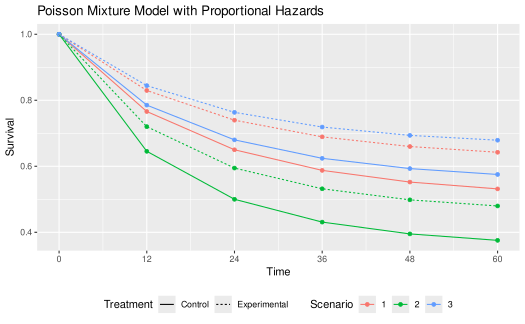
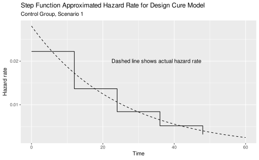
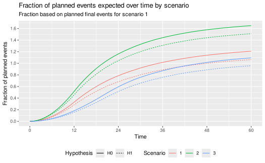

# A cure model calendar-based design

## Introduction

We present a study design for a time-to-event outcome based on a cure
model (Rodrigues et al. (2009)). In this case, it is assumed that tail
behavior for the survival curve is of substantial interest and there is
no desire to stop and do a final analysis before substantial follow-up
through 4 years has been allowed to accrue. It is assumed further if
substantial events have not accrued in this time period, then some
sacrifice in power would not be unreasonable. Due to this as well as
substantial variability in event accrual caused by feasible differences
in event rates, we use a calendar-based design, including calendar-based
spending (Lan and DeMets (1989)).

We discuss some of the potential advantages and disadvantages of the
cure model and calendar-based design cases where hazard rates for events
decrease substantially over time and the true underlying distributions
may meaningfully deviate from what is anticipated at the time of design.

## The Poisson mixture model

The Poisson mixture model is a cure model that can be useful when the
failure rate in a population is expected to decline substantially over
time based on historical data. It also has the property that if control
group time-to-event follows a Poisson mixture distribution, then a
proportional hazards assumption for treatment effect will yield another
Poisson mixture distribution for the experimental group. The model is
flexible and easy to use in that the control distribution is specified
with two parameters in a transparent fashion: the cure rate and one
other survival rate at an arbitrarily specified time point.

The Poisson mixture model (Rodrigues et al. (2009)) assumes a cure rate
\\p\\ to represent the patients who benefit long-term. The survival
function as a function of time \\t\\ for a control group (\\c\\) is:

\\S_c(t)=\exp(-\theta(1-\exp(-\lambda t))),\\ where \\\theta =
-\log(p)\\, \\\lambda\> 0\\ is a constant hazard rate and \\t\ge 0\\.
The component \\\exp(-\lambda t)\\ is an exponential survival
distribution; while it could be replaced with an arbitrary survival
distribution on \\t\>0\\ for the mixture model, the exponential model is
simple, adequately flexible and easy to explain. This two-parameter
model can be specified by the cure rate and the assumed survival rate
\\S_c(t_1)\\ at some time \\0 \<t_1\<\infty.\\ We can solve for
\\\theta\\ and \\\lambda\\ as follows:

\\S_c(\infty) = e^\theta \Rightarrow \theta = -\log(S_c(\infty)) \\ and
with a little algebra, we can solve for \\\lambda\\: \\S_c(t_1)=
\exp(-\theta(1-\exp(-\lambda t_1))) \Rightarrow \lambda = -\log(1 +
\log(S_c(t_1)) / \theta) / t_1\\ We note that under a proportional
hazards assumption with hazard ratio \\\gamma \> 0\\ the survival
function for the experimental group (e) is:

\\S_e(t)=\exp(-\theta\gamma(1-\exp(-\lambda t))).\\ For any setting
chosen, it is ideal to be able to cite published literature and other
rationale for study assumptions and show that the Poisson mixture
assumptions for the control group reasonably match historical data.

### Supporting functions

We create the following functions to support examples below.

- `pPM()` computes a Poisson mixture survival function
- `hPM()` computes Poisson mixture hazard rates

Most readers should skip reviewing this code.

``` r
# Poisson mixture survival
pPM <- function(x = 0:20, cure_rate = .5, t1 = 10, s1 = .6) {
  theta <- -log(cure_rate)
  lambda <- -log(1 + log(s1) / theta) / t1
  return(exp(-theta * (1 - exp(-lambda * x))))
}
# Poisson mixture hazard rate
hPM <- function(x = 0:20, cure_rate = .5, t1 = 10, s1 = .6) {
  theta <- -log(cure_rate)
  lambda <- -log(1 + log(s1) / theta) / t1
  return(theta * lambda * exp(-lambda * x))
}
```

### Scenario assumptions

We consider three scenarios to demonstrate how spending can impact
potential for trial success and fully understanding treatment group
differences. The following can be adjusted by the reader and the
vignette re-run.

``` r
# Control group assumptions for three Poisson mixture cure models
cure_rate <- c(.5, .35, .55)
# Second time point for respective models
t1 <- c(24, 24, 24)
# Survival rate at 2nd time point for respective models
s1 <- c(.65, .5, .68)
time_unit <- "month"
# Hazard ratio for experimental versus control for respective models
hr <- c(.7, .75, .7)
# Total study duration
study_duration <- c(48, 48, 56)
# Number of bins for piecewise approximation of Poisson mixture rates
bins <- 5
```

We will assume a constant enrollment rate for the duration of
enrollment, allowing different assumed enrollment durations by scenario.
The following code can be easily changed to study alternate scenarios.

``` r
# This code should be updated by user for their scenario
# Enrollment duration by scenario
enroll_duration <- c(12, 12, 20)
# Dropout rate (exponential failure rate per time unit) by scenario
dropout_rate <- c(.002, .001, .001)
```

### Examples

The points in the following graph indicate where underlying cumulative
hazard matches the piecewise exponential of the specified cure rate
models by scenario. The piecewise failure model is used to derive the
sample size and targeted events over time in the trial.



We also evaluate the failure rate over time for scenario 1, which is
used below in the design derivation. Note that the piecewise intervals
used to approximate changing hazard rates can be made arbitrarily small
to get more precise approximations of the above. However, given the
uncertainty of the underlying assumptions, it is not clear that this
provides any advantage.



### Event accumulation

Based on the above model, we predict how events will accumulate based on
either the null hypothesis of no failure rate difference or the
alternate hypothesis where events accrue more slowly in the experimental
group. We do this by scenario. We use as a denominator the final planned
events under the alternate hypothesis for scenario 1.

Now we compare event accrual under the null and alternate hypothesis for
each scenario, with 100% representing the targeted final events under
scenario 1. The user should not have to update the code here. For the 3
scenarios studied, event accrual is quite different, creating different
spending issues. As planned, the expected targeted event fraction
reaches 1 for Scenario 1 at 48 months under the alternate hypothesis.
Under the null hypothesis for this scenario, expected targeted events
are reached at approximately 36 months. For Scenario 2 the expectation
is that targeted events will be achieved in less than 24 months under
both the null and alternative hypotheses. Under Scenario 3, the expected
events under the alternative do not reach the target even by 60 months.



## Study design

### Design assumptions

We choose calendar-based timing for analyses as well as for spending.
This is not done automatically by the
[`gsSurv()`](https://keaven.github.io/gsDesign/reference/nSurv.md)
function, but is done using the
[`gsSurvCalendar()`](https://keaven.github.io/gsDesign/reference/gsSurvCalendar.md)
function. There are two things
[`gsSurvCalendar()`](https://keaven.github.io/gsDesign/reference/gsSurvCalendar.md)
takes care of:

- How to get information fraction levels that correspond to targeted
  calendar analysis times to plug in for the planned design.
- Replacing information fraction levels with calendar fraction levels
  for \\\alpha\\- and \\\beta\\-spending. Note that calendar-based
  analysis timing might often be used with information-based spending in
  many cases. In this case, the calendar-based timing is only used as an
  approximation to derive information fractions at interim analyses and
  timing of analyses would still be based on event counts regardless of
  the amount of time it takes to accumulate targeted events.

We begin by specifying calendar times of analysis and find corresponding
fractions of final planned events and calendar time under design
assumptions. Having the first interim at 14 months rather than 12 was
selected to get the expected events well above 100.

``` r
# Calendar time from start of randomization until each analysis time
calendarTime <- c(14, 24, 36, 48)
```

Now we move on to other design assumptions.

``` r
# Get hazard rate info for Scenario 1 control group
control <- hazard %>% filter(Scenario == 1, Treatment == "Control")
# Failure rates
lambdaC <- control$hazard_rate
# Interval durations
S <- (control$Time - control$time_lagged)[1:(bins - 1)]
# 1-sided Type I error
alpha <- 0.025
# Type II error (1 - power)
beta <- .1
# Test type 6: asymmetric 2-sided design, non-binding futility bound
test.type <- 6
# 1-sided Type I error used for safety (for asymmetric 2-sided design)
astar <- .2
# Spending functions (sfu, sfl) and parameters (sfupar, sflpar)
sfu <- sfHSD 
sfupar <- -3 
sfl <- sfLDPocock # Near-equal Z-values for each analysis
sflpar <- NULL # Not needed for Pocock spending
# Dropout rate (exponential parameter per unit of time)
dropout_rate <- 0.002
# Experimental / control randomization ratio
ratio <- 1
```

### Study design and event accumulation

We now assume a trial is enrolled with a constant enrollment rate over
12 months trial duration of 48. As noted above, the event accumulation
pattern is highly sensitive to the assumptions of the design. That is,
deviations from plan in accrual, the hazard ratio overall or over time
as well as relatively minor deviations from the cure model assumption
could substantially change the calendar time of event-based analysis
timing. Thus, calendar-based timing and spending (Lan and DeMets (1989))
may have some appeal to make the timing of analyses more predictable.
The main risk to this would likely be under-accumulation of the final
targeted events for the trial. The targeted 4-year window may be
considered clinically important as well as an important limitation for
trial duration. Using the above predicted information fractions at 12,
24, 36, and 48 months to plan a calendar-based design. Calendar-based
spending is likely to give more conservative interim bounds since the
calendar fractions are lower than the information fractions in the text
overlay of the plot after the first interim: 10%, 20%, 40%, 60%, 80% and
100%, respectively.

We now set up a calendar-based design.

``` r
design_calendar <-
  gsSurvCalendar(
    calendarTime = calendarTime,
    spending = "calendar",
    alpha = alpha,
    beta = beta,
    astar = astar,
    test.type = test.type,
    hr = hr[1],
    R = enroll_duration[1],
    gamma = 1,
    minfup = study_duration[1] - enroll_duration[1],
    ratio = ratio,
    sfu = sfu,
    sfupar = sfupar,
    sfl = sfl,
    sflpar = sflpar,
    lambdaC = lambdaC,
    S = S
  )
design_calendar %>%
  gsBoundSummary(exclude = c("B-value", "CP", "CP H1", "PP")) %>%
  gt() %>%
  tab_header(
    title = "Calendar-Based Design",
    subtitle = "Calendar Spending"
  )
```

| Calendar-Based Design |                    |          |          |
|-----------------------|--------------------|----------|----------|
| Calendar Spending     |                    |          |          |
| Analysis              | Value              | Efficacy | Futility |
| IA 1: 36%             | Z                  | 2.9057   | -1.3967  |
| N: 892                | p (1-sided)        | 0.0018   | 0.9188   |
| Events: 123           | ~HR at bound       | 0.5911   | 1.2875   |
| Month: 14             | Spending           | 0.0018   | 0.0812   |
|                       | P(Cross) if HR=1   | 0.0018   | 0.0812   |
|                       | P(Cross) if HR=0.7 | 0.1740   | 0.0004   |
| IA 2: 67%             | Z                  | 2.7193   | -1.3968  |
| N: 892                | p (1-sided)        | 0.0033   | 0.9188   |
| Events: 228           | ~HR at bound       | 0.6970   | 1.2037   |
| Month: 24             | Spending           | 0.0027   | 0.0428   |
|                       | P(Cross) if HR=1   | 0.0046   | 0.1240   |
|                       | P(Cross) if HR=0.7 | 0.4991   | 0.0004   |
| IA 3: 88%             | Z                  | 2.3641   | -1.2250  |
| N: 892                | p (1-sided)        | 0.0090   | 0.8897   |
| Events: 298           | ~HR at bound       | 0.7602   | 1.1527   |
| Month: 36             | Spending           | 0.0066   | 0.0416   |
|                       | P(Cross) if HR=1   | 0.0111   | 0.1656   |
|                       | P(Cross) if HR=0.7 | 0.7683   | 0.0004   |
| Final                 | Z                  | 2.0027   | -1.0839  |
| N: 892                | p (1-sided)        | 0.0226   | 0.8608   |
| Events: 337           | ~HR at bound       | 0.8039   | 1.1254   |
| Month: 48             | Spending           | 0.0139   | 0.0344   |
|                       | P(Cross) if HR=1   | 0.0250   | 0.2000   |
|                       | P(Cross) if HR=0.7 | 0.9000   | 0.0004   |

## Considerations

There are a few things to note for the above design:

- The futility bounds are advisory only. In particular, the late
  futility bounds may be ignored since the follow-up for the full time
  period may merit continuing the trial.
- The efficacy spending function should be carefully considered to
  ensure the evidence required to cross any bound is likely to justify
  early stopping with a definitive demonstration of benefit.
- Substantial deviations in event accumulation would not change timing
  of analyses from their calendar times. This should be considered for
  acceptability at the time of design.
- The trial may be continued after crossing an efficacy bound for
  further follow-up as it is unlikely that control patients doing well
  would cross over to experimental therapy in absence of adverse
  clinical outcomes. Inference at subsequent analyses using repeated
  \\p\\-values (Jennison and Turnbull (2000)) or sequential \\p\\-values
  (Liu and Anderson (2008)) are well-specified and interpretable as
  adjusted \\p\\-values.

## References

Jennison, Christopher, and Bruce W. Turnbull. 2000. *Group Sequential
Methods with Applications to Clinical Trials*. Boca Raton, FL: Chapman;
Hall/CRC.

Lan, K. K. G., and David L. DeMets. 1989. “Group Sequential Procedures:
Calendar Versus Information Time.” *Statistics in Medicine* 8: 1191–98.

Liu, Qing, and Keaven M Anderson. 2008. “On Adaptive Extensions of Group
Sequential Trials for Clinical Investigations.” *Journal of the American
Statistical Association* 103 (484): 1621–30.

Rodrigues, Josemar, Vicente G Cancho, Mário de Castro, and Francisco
Louzada-Neto. 2009. “On the Unification of Long-Term Survival Models.”
*Statistics & Probability Letters* 79 (6): 753–59.
