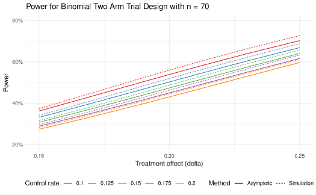

# Binomial two arm trial design and analysis

## Overview and notation

This vignette provides an overview of the binomial two arm trial design
and analysis. We consider designs for superiority, non-inferiority, and
super-superiority trials. These can reflect binary endpoints measuring
successful outcomes (e.g., response) or unsuccessful outcomes (e.g.,
failure). We focus here on risk-difference and fixed (not group
sequential) designs to limit the scope. Both risk ratio and odds ratio
are also available in the package as outlined in Miettinen and Nurminen
(1985).

The basic method for computing the fixed sample size that is the basis
for group sequential design sizes for superiority was developed by
Fleiss, Tytun, and Ury (1980), but is applied here without the
continuity correction as recommended by Gordon and Watson (1996). This
method was extended to non-inferiority and super-superiority trials by
Farrington and Manning (1990).

We will see that while asymptotic formulations are generally good
approximations, fast simulation methods can provide more accurate
results both for Type I error and power.

The R packages we use are:

``` r
library(gsDesign)
library(ggplot2)
library(tidyr)
library(gt)
library(dplyr)
```

## Sample size

The rate arguments in
[`nBinomial()`](https://keaven.github.io/gsDesign/reference/varBinomial.md)
are `p1` and `p2`. `p1` is the rate in group 1 and `p2` is the rate in
group 2. For a simple example, we can compute the sample size for a
superiority design with a 2:1 sample size ratio where the experimental
and control groups have assumed success rates of 0.2 and 0.1,
respectively. One-sided Type I error is 0.025 and Type II error is 0.15
(power is 85%). This gives the same result if the roles of `p1` and `p2`
are changed and `ratio` is inverted.

``` r
nBinomial(p1 = 0.2, p2 = 0.1, ratio = 2, alpha = 0.025, beta = 0.15) %>% ceiling()
#> [1] 496
nBinomial(p1 = 0.1, p2 = 0.2, ratio = 0.5, alpha = 0.025, beta = 0.15) %>% ceiling()
#> [1] 496
```

The above results apply as well to a failure endpoint, but now 0.2 would
be the control group rate and 0.1 would be the experimental group rate.
Results can also be computed using the risk-ratio and odds-ratio methods
of Miettinen and Nurminen (1985). For 2:1 randomization
(Experimental:Control) we set `ratio = 0.5` since group 1 represents the
control group in the following. We see the results are the same for the
risk-ratio method as the risk-difference method from above (default
`scale = "Difference"`). For the odds-ratio method, we see the sample
size is larger in this case.

``` r
scale <- c("Difference", "RR", "OR")
tibble(scale, "Sample size" = c(
  nBinomial(p1 = 0.2, p2 = 0.1, ratio = 0.5, alpha = 0.025, beta = 0.15, scale = scale[1]) %>% ceiling(),
  nBinomial(p1 = 0.2, p2 = 0.1, ratio = 0.5, alpha = 0.025, beta = 0.15, scale = scale[2]) %>% ceiling(),
  nBinomial(p1 = 0.2, p2 = 0.1, ratio = 0.5, alpha = 0.025, beta = 0.15, scale = scale[3]) %>% ceiling()
)) %>%
  gt() %>%
  tab_header("Sample size by scale for a superiority design",
    subtitle = "alpha = 0.025, beta = 0.15, pE = 0.2, pC = 0.1"
  )
```

| Sample size by scale for a superiority design  |             |
|------------------------------------------------|-------------|
| alpha = 0.025, beta = 0.15, pE = 0.2, pC = 0.1 |             |
| scale                                          | Sample size |
| Difference                                     | 525         |
| RR                                             | 525         |
| OR                                             | 489         |

## Testing and confidence intervals

Next we assume we have results from a trial with 20 / 30 and 10 / 30
successes in the two groups. The
[`testBinomial()`](https://keaven.github.io/gsDesign/reference/varBinomial.md)
function computes the Z-value for a binomial test. We see that the scale
chosen (default is `"Difference"`) does not matter for the Z-value.

``` r
testBinomial(x1 = 20, n1 = 30, x2 = 10, n2 = 30)
#> [1] 2.581989
testBinomial(x1 = 20, n1 = 30, x2 = 10, n2 = 30, scale = "RR")
#> [1] 2.581989
testBinomial(x1 = 20, n1 = 30, x2 = 10, n2 = 30, scale = "OR")
#> [1] 2.581989
```

As opposed to
[`nBinomial()`](https://keaven.github.io/gsDesign/reference/varBinomial.md),
it makes a difference how treatment groups are assigned. For example, if
we have 20 / 30 and 10 / 30 successes in the two groups, we can compute
the Z-value for a binomial test of the null hypothesis that the
difference between the two groups is equal to 0.

``` r
testBinomial(x1 = 10, n1 = 30, x2 = 20, n2 = 30)
#> [1] -2.581989
```

We compute a one-sided asymptotic \\p\\-value using the default method
of Farrington and Manning (1990). With `adj = 1`, we use the Miettinen
and Nurminen (1985) method which multiplies the variance estimate of the
rate difference by `n / (n - 1)` (continuity correction). Generally, not
using the continuity correction is preferred (Gordon and Watson (1996)).
The `adj` argument is available in
[`testBinomial()`](https://keaven.github.io/gsDesign/reference/varBinomial.md),
[`ciBinomial()`](https://keaven.github.io/gsDesign/reference/varBinomial.md)
and
[`simBinomial()`](https://keaven.github.io/gsDesign/reference/varBinomial.md),
but is not used in
[`nBinomial()`](https://keaven.github.io/gsDesign/reference/varBinomial.md).
Since the Chi-square test is often used, we show that it gives a 2-sided
\\p\\-value that is twice the one-sided \\p\\-value.

``` r
testBinomial(x1 = 10, n1 = 30, x2 = 20, n2 = 30) %>% pnorm(lower.tail = TRUE)
#> [1] 0.004911637
testBinomial(x1 = 10, n1 = 30, x2 = 20, n2 = 30, adj = 1) %>% pnorm(lower.tail = TRUE)
#> [1] 0.005227859
testBinomial(x1 = 10, n1 = 30, x2 = 20, n2 = 30, chisq = 1) %>%
  pchisq(df = 1, lower.tail = FALSE) / 2
#> [1] 0.004911637
```

We can compute a confidence interval for the rate difference using the
[`ciBinomial()`](https://keaven.github.io/gsDesign/reference/varBinomial.md)
function.

``` r
p1 <- 20 / 30
p2 <- 10 / 30
rd <- p1 - p2
rr <- p1 / p2
orr <- (p1 * (1 - p2)) / (p2 * (1 - p1))

rbind(
  ciBinomial(x1 = 20, n1 = 30, x2 = 10, n2 = 30),
  ciBinomial(x1 = 20, n1 = 30, x2 = 10, n2 = 30, scale = "RR"),
  ciBinomial(x1 = 20, n1 = 30, x2 = 10, n2 = 30, scale = "OR")
) %>%
  mutate(
    scale = c("Risk difference", "Risk-ratio", "Odds-ratio"),
    Effect = c(rd, rr, orr)
  ) %>%
  gt() %>%
  tab_header("Confidence intervals for a binomial effect size",
    subtitle = "x1 = 20, n1 = 30, x2 = 10, n2 = 30"
  ) %>%
  fmt_number(columns = c(lower, upper, Effect), n_sigfig = 3)
```

| Confidence intervals for a binomial effect size |       |                 |        |
|-------------------------------------------------|-------|-----------------|--------|
| x1 = 20, n1 = 30, x2 = 10, n2 = 30              |       |                 |        |
| lower                                           | upper | scale           | Effect |
| 0.0812                                          | 0.545 | Risk difference | 0.333  |
| 1.17                                            | 3.62  | Risk-ratio      | 2.00   |
| 1.38                                            | 11.6  | Odds-ratio      | 4.00   |

Again, how treatment groups are assigned makes a difference.

``` r
ciBinomial(x1 = 10, n1 = 30, x2 = 20, n2 = 30)
#>        lower       upper
#> 1 -0.5454184 -0.08115662
```

## Non-inferiority and super-superiority

By setting a non-inferiority margin, we can loosen the stringency on
what is required compared to a superiority study. The trial need only
show the experimental treatment is **close to** as good as control
treatment. By setting a super-superiority margin, we can show that the
experimental treatment is **better than** the control treatment by at
least a specified amount. This increases the stringency of the design
compared to a superiority study. The method of Farrington and Manning
(1990) is used for both non-inferiority and super-superiority designs.
The parameter `delta0` sets the margin with `delta0 = 0` for
superiority, `delta0 < 0` for non-inferiority, and `delta0 > 0` for
super-superiority. We see that this has a substantial impact on the
sample size requirement to achieve desired power.

``` r
tibble(
  Design = c("Superiority", "Non-inferiority", "Super-superiority"),
  `p1 (pE)` = c(0.2, 0.2, 0.2),
  `p2 (pC)` = c(0.1, 0.1, 0.1),
  `delta0` = c(0, -0.02, 0.02),
  `Sample size` = c(
    ceiling(nBinomial(p1 = 0.2, p2 = 0.1, alpha = 0.025, beta = 0.15, ratio = 0.5)),
    ceiling(nBinomial(p1 = 0.2, p2 = 0.1, alpha = 0.025, beta = 0.15, ratio = 0.5, delta0 = -0.02)),
    ceiling(nBinomial(p1 = 0.2, p2 = 0.1, alpha = 0.025, beta = 0.15, ratio = 0.5, delta0 = 0.02))
  )
) %>%
  gt() %>%
  tab_header("Sample size for binomial two arm trial design",
    subtitle = "alpha = 0.025, beta = 0.15"
  ) %>%
  fmt_number(columns = c(`p1 (pE)`, `p2 (pC)`), decimals = 2) %>%
  cols_label(
    Design = "Design",
    `p1 (pE)` = "Experimental group rate",
    `p2 (pC)` = "Control group rate",
    delta0 = "Null hypothesis value of rate difference (delta0)",
    `Sample size` = "Sample size"
  ) %>%
  tab_footnote("Randomization ratio is 2:1 (Experimental:Control) with assumed control failure rate p1 = 0.2 and experimental rate 0.1.")
```

| Sample size for binomial two arm trial design                                                                           |                         |                    |                                                   |             |
|-------------------------------------------------------------------------------------------------------------------------|-------------------------|--------------------|---------------------------------------------------|-------------|
| alpha = 0.025, beta = 0.15                                                                                              |                         |                    |                                                   |             |
| Design                                                                                                                  | Experimental group rate | Control group rate | Null hypothesis value of rate difference (delta0) | Sample size |
| Superiority                                                                                                             | 0.20                    | 0.10               | 0.00                                              | 525         |
| Non-inferiority                                                                                                         | 0.20                    | 0.10               | -0.02                                             | 375         |
| Super-superiority                                                                                                       | 0.20                    | 0.10               | 0.02                                              | 796         |
| Randomization ratio is 2:1 (Experimental:Control) with assumed control failure rate p1 = 0.2 and experimental rate 0.1. |                         |                    |                                                   |             |

Testing for non-inferiority and super-superiority is equivalent to
whether or not the confidence intervals contain the margin `delta0`.
Since both the superiority and non-inferiority Z-tests exceed the
critical value of 1.96, both tests are significant. The third test fails
to establish super-superiority since the Z-value is less than 1.96.
Since the confidence interval contains 0.02 but neither 0 nor -0.02, it
comes to the same conclusion as all 3 of these tests.

``` r
testBinomial(x1 = 18, n1 = 30, x2 = 10, n2 = 30, delta0 = 0) # superiority
#> [1] 2.070197
testBinomial(x1 = 18, n1 = 30, x2 = 10, n2 = 30, delta0 = -0.02) # non-inferiority
#> [1] 2.225796
testBinomial(x1 = 18, n1 = 30, x2 = 10, n2 = 30, delta0 = 0.02) # super-superiority
#> [1] 1.915403
ciBinomial(x1 = 18, n1 = 30, x2 = 10, n2 = 30) # CI
#>        lower     upper
#> 1 0.01426069 0.4872467
```

## Simulation

The
[`simBinomial()`](https://keaven.github.io/gsDesign/reference/varBinomial.md)
function simulates the binomial distribution to compute the Z-value. It
does not simulate individual observations, but rather simulates the
binomial distribution.
[`simBinomial()`](https://keaven.github.io/gsDesign/reference/varBinomial.md)
has the same arguments as
[`testBinomial()`](https://keaven.github.io/gsDesign/reference/varBinomial.md)
but also includes the number of simulated trials in the argument `nsim`.
A vector of Z-values is returned.

``` r
simBinomial(p1 = 0.2, p2 = 0.1, n1 = 30, n2 = 30, nsim = 10)
#>  [1] -0.6928203  0.8606630  1.3856406  1.5191091  2.2786636  1.3856406
#>  [7]  0.0000000  1.2909944  2.0784610  2.3354968
```

To see if the asymptotic method controls Type I error at the desired
level, we can compute the Type I error rate from the simulated Z-values.

``` r
z <- simBinomial(p1 = 0.15, p2 = 0.15, n1 = 30, n2 = 30, nsim = 1000000)
mean(z > qnorm(0.975)) # Type I error rate
#> [1] 0.026329
```

We see that the Type I error rate is slightly inflated. To get an exact
Type I error rate, we can compute the appropriate quantile of the
simulated Z-values. We say exact, but the degree of exactness depends on
the number of simulations which is 1 million in this case. Since the
[`simBinomial()`](https://keaven.github.io/gsDesign/reference/varBinomial.md)
function is fast, we can use a large number of simulations. In any case,
this produces a slightly conservative Type I error rate.

``` r
zcut <- quantile(z, 0.975)
tibble("Z cutoff" = zcut, "p cutoff" = pnorm(zcut, lower.tail = FALSE)) %>%
  gt() %>%
  fmt_number(columns = c("Z cutoff", "p cutoff"), n_sigfig = 3) %>%
  tab_header("Exact cutoff for Type I error rate",
    subtitle = "Based on 1 million simulations"
  ) %>%
  tab_footnote("The Z cutoff is the quantile of the simulated Z-values at 0.975 using p1 = p2 = 0.15.")
```

| Exact cutoff for Type I error rate                                                    |          |
|---------------------------------------------------------------------------------------|----------|
| Based on 1 million simulations                                                        |          |
| Z cutoff                                                                              | p cutoff |
| 2.01                                                                                  | 0.0222   |
| The Z cutoff is the quantile of the simulated Z-values at 0.975 using p1 = p2 = 0.15. |          |

Now we examine power with the asymptotic and exact cutoffs.

``` r
z <- simBinomial(p1 = 0.2, p2 = 0.1, n1 = 30, n2 = 30, nsim = 1000000)
cat("Power with asymptotic cutoff ", mean(z > qnorm(0.975)))
#> Power with asymptotic cutoff  0.192442
cat("\nPower with exact cutoff", mean(z > zcut))
#> 
#> Power with exact cutoff 0.166563
```

Finally, we compute power based on simulation for the sample size
calculation above. We see in this case that the sample size of 489 based
on the odds-ratio formulation more accurately approximates the targeted
85% power.

``` r
ptab <- tibble(
  Scale = c("Risk-difference", "Odds-ratio"),
  n = c(525, 489),
  Power = c(
    mean(simBinomial(p1 = 0.2, p2 = 0.1, n1 = 525 / 3, n2 = 525 * 2 / 3, nsim = 100000) > qnorm(0.975)),
    mean(simBinomial(p1 = 0.2, p2 = 0.1, n1 = 489 / 3, n2 = 489 * 2 / 3, nsim = 100000) > qnorm(0.975))
  )
)
ptab %>%
  gt() %>%
  tab_header("Simulation power for sample size based on risk-difference and odds-ratio",
    subtitle = "pE = 0.2, pC = 0.1, alpha = 0.025, beta = 0.15"
  ) %>%
  fmt_number(columns = c(n, Power), n_sigfig = 3) %>%
  cols_label(Scale = "Scale", n = "Sample size", Power = "Power") %>%
  tab_footnote("Power based on 100,000 simulated trials and nominal alpha = 0.025 test; 2 x simulation error = 0.002") %>%
  tab_footnote("Power based on Z-test for risk-difference with no continuity correction.", location = cells_column_labels("Power"))
```

| Simulation power for sample size based on risk-difference and odds-ratio                             |             |        |
|------------------------------------------------------------------------------------------------------|-------------|--------|
| pE = 0.2, pC = 0.1, alpha = 0.025, beta = 0.15                                                       |             |        |
| Scale                                                                                                | Sample size | Power¹ |
| Risk-difference                                                                                      | 525         | 0.871  |
| Odds-ratio                                                                                           | 489         | 0.855  |
| Power based on 100,000 simulated trials and nominal alpha = 0.025 test; 2 x simulation error = 0.002 |             |        |
| ¹ Power based on Z-test for risk-difference with no continuity correction.                           |             |        |

## Power table

The
[`binomialPowerTable()`](https://keaven.github.io/gsDesign/reference/binomialPowerTable.md)
function computes power for a given sample size and treatment effect
across a range of underlying control event rates (`pC`) and effect sizes
(`delta`). Both the asymptotic and simulation methods are available. The
simulation method with a large simulation size is an accurate exact
method. Thus,
[`binomialPowerTable()`](https://keaven.github.io/gsDesign/reference/binomialPowerTable.md)
provides a shortcut for the exact method power calculation. We see that
the Type I error achieved depends using the asymptotic cutoff varies by
the underlying control rate, reaching almost 0.03 when the underlying
failure rate is 0.10.

``` r
binomialPowerTable(
  pC = seq(0.1, 0.2, 0.02), delta = 0, delta0 = 0, n = 70, failureEndpoint = TRUE,
  ratio = 1, alpha = 0.025, simulation = TRUE, nsim = 1e6, adj = 0
) %>%
  rename("Type I error" = "Power") %>%
  gt() %>%
  fmt_number(columns = "Type I error", n_sigfig = 3) %>%
  tab_header("Type I error is not controlled with nominal p = 0.025 cutoff")
```

| Type I error is not controlled with nominal p = 0.025 cutoff |       |      |              |
|--------------------------------------------------------------|-------|------|--------------|
| pC                                                           | delta | pE   | Type I error |
| 0.10                                                         | 0     | 0.10 | 0.0285       |
| 0.12                                                         | 0     | 0.12 | 0.0282       |
| 0.14                                                         | 0     | 0.14 | 0.0269       |
| 0.16                                                         | 0     | 0.16 | 0.0256       |
| 0.18                                                         | 0     | 0.18 | 0.0251       |
| 0.20                                                         | 0     | 0.20 | 0.0245       |

Adding the continuity correction (`adj = 1`) helps a small amount at
better controlling Type I error in this case. However, changing the
nominal cutoff to `alpha = 0.023` without continuity correction is more
successful at controlling Type I error consistently.

``` r
binomialPowerTable(
  pC = seq(0.1, 0.2, 0.02), delta = 0, delta0 = 0, n = 70, failureEndpoint = TRUE,
  ratio = 1, alpha = 0.023, simulation = TRUE, nsim = 1e6, adj = 0
) %>%
  rename("Type I error" = "Power") %>%
  gt() %>%
  fmt_number(columns = "Type I error", n_sigfig = 3) %>%
  tab_header("Type I error is controlled at 0.025 with nominal p = 0.023 cutoff")
```

| Type I error is controlled at 0.025 with nominal p = 0.023 cutoff |       |      |              |
|-------------------------------------------------------------------|-------|------|--------------|
| pC                                                                | delta | pE   | Type I error |
| 0.10                                                              | 0     | 0.10 | 0.0211       |
| 0.12                                                              | 0     | 0.12 | 0.0218       |
| 0.14                                                              | 0     | 0.14 | 0.0227       |
| 0.16                                                              | 0     | 0.16 | 0.0231       |
| 0.18                                                              | 0     | 0.18 | 0.0237       |
| 0.20                                                              | 0     | 0.20 | 0.0238       |

Now we look at power for a range of control rates and treatment effects.
[`binomialPowerTable()`](https://keaven.github.io/gsDesign/reference/binomialPowerTable.md)
uses all combinations of the input control group rate (`pC`) and
treatment effect (`delta`). We use a nominal `alpha = 0.023` based on
the simulations above to control Type I error. Initially we base power
on the asymptotic approximation.

``` r
power_table_asymptotic <- binomialPowerTable(
  pC = seq(0.1, 0.2, 0.025),
  delta = seq(0.15, 0.25, 0.02),
  n = 70,
  ratio = 1,
  alpha = 0.023
)
```

Now we produce the same table based on 1 million simulations.

``` r
power_table_simulation <- binomialPowerTable(
  pC = seq(0.1, 0.2, 0.025),
  delta = seq(0.15, 0.25, 0.02),
  n = 70,
  ratio = 1,
  alpha = 0.023,
  simulation = TRUE,
  nsim = 1000000
)
```

We summarize these results in a plot and see that simulations suggest
the asymptotic approximation slightly underestimates power. However, for
all the `pC` and `delta` combinations evaluated, power is above 90% for
all cases.

``` r
rbind(
  power_table_asymptotic %>% mutate(Method = "Asymptotic"),
  power_table_simulation %>% mutate(Method = "Simulation")
) %>%
  ggplot(aes(x = delta, y = Power, color = factor(pC), lty = Method)) +
  geom_line() +
  labs(x = "Treatment effect (delta)", y = "Power", color = "Control rate") +
  scale_color_brewer(palette = "Set1") +
  theme_minimal() +
  theme(legend.position = "bottom") +
  # Grid points on the x-axis at 0.05 intervals
  scale_x_continuous(breaks = seq(0.15, 0.25, by = 0.05)) +
  # Put y-axis scale on percent scale
  scale_y_continuous(
    labels = scales::percent_format(accuracy = 1),
    breaks = seq(0.2, 0.8, by = 0.2)
  ) +
  coord_cartesian(ylim = c(0.2, 0.8)) +
  ggtitle("Power for Binomial Two Arm Trial Design with n = 70")
```



Following is a table of the simulation results from above in a wide
format.

``` r
# Transform table with values from Power to a wide format with
# Put "Control group rate" (pC) in rows and Treatment effect (delta) in columns
# Put a spanner label over columns after first column with label "Treatment effect (delta)"
power_table_simulation %>%
  select(-pE) %>%
  tidyr::pivot_wider(
    names_from = delta,
    values_from = Power
  ) %>%
  dplyr::rename(`Control group rate` = pC) %>%
  gt::gt() %>%
  gt::tab_spanner(
    label = "Treatment effect (delta)",
    columns = 2:7
  ) %>%
  gt::fmt_percent(decimals = 1) %>%
  gt::tab_header("Power by Control Group Rate and Treatment Effect")
```

[TABLE]

## Summary

We have demonstrated sample size and power calculations for 2-arm
binomial trial designs. Both asymptotic approximations and exact methods
based on large simulations have been used. We focus on the Miettinen and
Nurminen (1985) risk-difference asymptotic method for testing of
differences, but without continuity correction as recommended by Gordon
and Watson (1996). This method generalizes to non-inferiority and
super-superiority trials as proposed by Farrington and Manning (1990).
The risk-ratio and odds-ratio methods are also available. We have also
shown how to compute Type I error and power using simulation methods.
Based on the high-speed of simulations, there may be some value in using
simulation to evaluate Type I error across a range of event rates and
then use appropriate nominal cutoffs to evaluate power. These adjusted
cutoffs would then also be used for testing when the trial is completed.
This is different than Fisher’s exact test which which conditions on the
total number of events observed. Results may vary under different
circumstances, so that while the odds-ratio sample size method was more
accurate for the given example, this result has not been generalized.

## References

Farrington, Conor P, and Godfrey Manning. 1990. “Test Statistics and
Sample Size Formulae for Comparative Binomial Trials with Null
Hypothesis of Non-Zero Risk Difference or Non-Unity Relative Risk.”
*Statistics in Medicine* 9 (12): 1447–54.

Fleiss, Joseph L, Alex Tytun, and Hans K Ury. 1980. “A Simple
Approximation for Calculating Sample Sizes for Comparing Independent
Proportions.” *Biometrics* 36 (2): 343–46.

Gordon, Ian, and Ray Watson. 1996. “The Myth of Continuity-Corrected
Sample Size Formulae.” *Biometrics* 52 (1): 71–76.

Miettinen, Olli, and Markku Nurminen. 1985. “Comparative Analysis of Two
Rates.” *Statistics in Medicine* 4 (2): 213–26.
