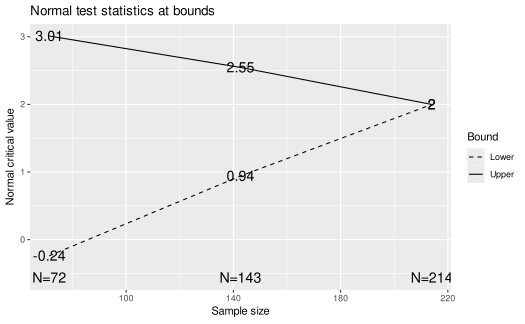

# gsDesign package overview

## Introduction

gsDesign is a package for deriving and describing group sequential
designs. The package allows particular flexibility for designs with
alpha- and beta-spending. Many plots are available for describing design
properties.

The gsDesign package supports group sequential clinical trial design.
While there is a strong focus on designs using \\\alpha\\- and
\\\beta\\-spending functions, Wang-Tsiatis designs, including
O’Brien-Fleming and Pocock designs, are also available. The ability to
design with non-binding futility rules allows control of Type I error in
a manner acceptable to regulatory authorities when futility bounds are
employed.

The routines are designed to provide simple access to commonly used
designs using default arguments. Standard, published spending functions
are supported as well as the ability to write custom spending functions.
A `gsDesign` class is defined and returned by the
[`gsDesign()`](https://keaven.github.io/gsDesign/reference/gsDesign.md)
function. A plot function for this class provides a wide variety of
plots: boundaries, power, estimated treatment effect at boundaries,
conditional power at boundaries, spending function plots, expected
sample size plot, and B-values at boundaries. Using function calls to
access the package routines provides a powerful capability to derive
designs or output formatting that could not be anticipated through a GUI
interface. This enables the user to easily create designs with features
they desire, such as designs with minimum expected sample size.

Thus, the intent of the gsDesign package is to easily create, fully
characterize and even optimize routine group sequential trial designs as
well as provide a tool to evaluate innovative designs.

## Example

Here is a minimal example assuming a fixed design (no interim) trial
with the same endpoint requires 200 subjects for 90% power at \\\alpha\\
= 0.025, one-sided:

``` r
library(gsDesign)

x <- gsDesign(n.fix = 200)
plot(x)
```



``` r
gsBoundSummary(x)
#>   Analysis               Value Efficacy Futility
#>  IA 1: 33%                   Z   3.0107  -0.2387
#>      N: 72         p (1-sided)   0.0013   0.5943
#>                ~delta at bound   1.5553  -0.1233
#>            P(Cross) if delta=0   0.0013   0.4057
#>            P(Cross) if delta=1   0.1412   0.0148
#>  IA 2: 67%                   Z   2.5465   0.9411
#>     N: 143         p (1-sided)   0.0054   0.1733
#>                ~delta at bound   0.9302   0.3438
#>            P(Cross) if delta=0   0.0062   0.8347
#>            P(Cross) if delta=1   0.5815   0.0437
#>      Final                   Z   1.9992   1.9992
#>     N: 214         p (1-sided)   0.0228   0.0228
#>                ~delta at bound   0.5963   0.5963
#>            P(Cross) if delta=0   0.0233   0.9767
#>            P(Cross) if delta=1   0.9000   0.1000
```

## References

Jennison, Christopher, and Bruce W. Turnbull. 2000. *Group Sequential
Methods with Applications to Clinical Trials*. Boca Raton, FL: Chapman;
Hall/CRC.

Proschan, Michael A., K. K. Gordon Lan, and Janet Turk Wittes. 2006.
*Statistical Monitoring of Clinical Trials: A Unified Approach*. New
York, NY: Springer.
