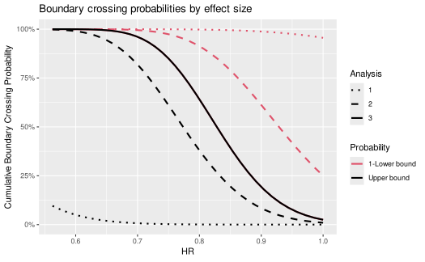

# Basic time-to-event group sequential design using gsSurv

## Introduction

This article/vignette provides a basic time-to-event endpoint designs
for fixed designs using
[`nSurv()`](https://keaven.github.io/gsDesign/reference/nSurv.md) and
group sequential designs using
[`gsSurv()`](https://keaven.github.io/gsDesign/reference/nSurv.md). Some
detail in specification comes with the flexibility allowed by the Lachin
and Foulkes (1986) method for sample size under a proportional hazards
model with piecewise constant enrollment, piecewise exponential failure
and dropout rates. Users may also be interested in the [Shiny
interface](https://gsdesign.shinyapps.io/prod/) as a learning tool. We
only use the simplest options here with a single stratum and exponential
failure and dropout rates; see the help file for
[`gsSurv()`](https://keaven.github.io/gsDesign/reference/nSurv.md) for
examples with a stratified population or piecewise exponential failure.

We apply the Lachin and Foulkes (1986) sample size method and extend it
to group sequential design. This method fixes the duration of a study
and varies enrollment rates to power a trial. We also use the Lachin and
Foulkes (1986) basic power calculation to compute sample size along the
lines of Kim and Tsiatis (1990) where enrollment rates are fixed and
enrollment duration is allowed to vary to enroll a sufficient sample
size to power a study.

## Fixed design derivation

Since the parameters used for a design with no interim are also used for
a group sequential design, we first specify and derive a design with no
interim analysis.

### Outcome and dropout distributions

We begin with information about the median time-to-event in the control
group, dropout rate, hazard ratios under the null and alternate
hypotheses for experimental therapy compared to control, and the desired
Type I and II error rates.

``` r
# Median control time-to-event
median <- 12
# Exponential dropout rate per unit of time
eta <- .001
# Hypothesized experimental/control hazard ratio
# (alternate hypothesis)
hr <- .75
# Null hazard ratio (1 for superiority, >1 for non-inferiority)
hr0 <- 1
# Type I error (1-sided)
alpha <- .025
# Type II error (1-power)
beta <- .1
```

### Enrollment and trial duration

Next, we plan the trial duration and the enrollment pattern. There are
two basic methods for doing this. The Lachin and Foulkes (1986) method
demonstrated here fixes the enrollment pattern and duration as well as
the trial duration and changes the absolute enrollment rates to obtain
desired power. The alternate recommended method is along the lines of
Kim and Tsiatis (1990), fixing the enrollment rates and follow-up
duration, varying the total trial duration to power the design; this
will also be demonstrated below.

``` r
# Study duration
T <- 36
# Follow-up duration of last patient enrolled
minfup <- 12
# Enrollment period durations
R <- c(1, 2, 3, 4)
# Relative enrollment rates during above periods
gamma <- c(1, 1.5, 2.5, 4)
# Randomization ratio, experimental/control
ratio <- 1
```

### Deriving design with no interim analyses

The above information is sufficient to design a trial with no interim
analyses. Note that when calling
[`nSurv()`](https://keaven.github.io/gsDesign/reference/nSurv.md), we
transform the median time-to-event (\\m\\) to an exponential event rate
(\\\lambda\\) with the formula \\\lambda=\log(2)/m.\\

``` r
library(gsDesign)

x <- nSurv(
  R = R,
  gamma = gamma,
  eta = eta,
  minfup = minfup,
  T = T,
  lambdaC = log(2) / median,
  hr = hr,
  hr0 = hr0,
  beta = beta,
  alpha = alpha
)
```

A textual summary of this design is given by printing it. For the group
sequential design shown later, much more complete formatted output will
be shown.

``` r
x
#> nSurv fixed-design summary (method=LachinFoulkes; target=Accrual rate)
#> HR=0.750 vs HR0=1.000 | alpha=0.025 (sided=1) | power=90.0%
#> N=775.0 subjects | D=507.2 events | T=36.0 study duration | accrual=24.0 Accrual duration | minfup=12.0 minimum follow-up | ratio=1 randomization ratio (experimental/control)
#> 
#> Key inputs (names preserved):
#>                                desc    item
#>                     Accrual rate(s)   gamma
#>            Accrual rate duration(s)       R
#>              Control hazard rate(s) lambdaC
#>             Control dropout rate(s)     eta
#>        Experimental dropout rate(s)    etaE
#>  Event and dropout rate duration(s)       S
#>                              value
#>  9.282, 13.923, 23.205 ... (len=4)
#>                1, 2, 3 ... (len=4)
#>                              0.058
#>                              0.001
#>                              0.001
#>                               NULL
#>                    input
#>  1, 1.5, 2.5 ... (len=4)
#>      1, 2, 3 ... (len=4)
#>                    0.058
#>                    0.001
#>                     etaE
#>                        S
```

### Varying enrollment duration to power trial

If we had set `T = NULL` above, the specified enrollment rates would not
be changed but enrollment duration would be adjusted to achieve desired
power. For the low enrollment rates specified in `gamma` above, this
would have resulted in a long trial.

``` r
# THIS CODE IS EXAMPLE ONLY; NOT EXECUTED HERE
nSurv(
  R = R,
  gamma = gamma,
  eta = eta,
  minfup = minfup,
  T = NULL, # This was changed
  lambdaC = log(2) / median,
  hr = hr,
  hr0 = hr0,
  beta = beta,
  alpha = alpha
)
```

## Group sequential design

Now we move on to a group sequential design.

### Additional parameters

All the parameters above are used. We set up the number of analyses,
timing and spending function parameters. These deserve careful attention
for every trial and tend to be somewhat customized to be fit-for-purpose
according to all those involved in designing the trial. Here the choices
considered the following:

- There is an early look intended primarily for futility
  - There is no desire to stop this early for lack of a positive trend
  - An earlier interim might be too soon to stop for a meaningful safety
    problem
  - There is no desire to stop for efficacy, so the extreme effect size
    and p-value required to cross the bound is considered appropriate
- The second interim is primarily for efficacy
  - The data will be relatively mature, but a meaningful length of time
    before planned final analysis
  - The treatment effect at the efficacy bound will likely be at least
    the treatment effect used to power the trial
  - The Lan-DeMets spending function approximating an O’Brien-Fleming
    bound Lan and DeMets (1983) is often acceptable to regulators for
    early stopping

``` r
# Number of analyses (interim + final)
k <- 3
# Timing of interim analyses (k-1 increasing numbers >0 and <1).
# Proportion of final events at each interim.
timing <- c(.25, .75)
# Efficacy bound spending function.
# We use Lan-DeMets spending function approximating O'Brien-Fleming bound.
# No parameter required for this spending function.
sfu <- sfLDOF
sfupar <- NULL
# Futility bound spending function
sfl <- sfHSD
# Futility bound spending parameter specification
sflpar <- -7
```

Type II error (1-power) may be set up differently than for a fixed
design so that more meaningful futility analyses can be performed during
the course of the trial.

``` r
# Type II error = 1 - Power
beta <- .15
```

### Generating the design

Now we are prepared to generate the design.

``` r
# Generate design
x <- gsSurv(
  k = k, timing = timing, R = R, gamma = gamma, eta = eta,
  minfup = minfup, T = T, lambdaC = log(2) / median,
  hr = hr, hr0 = hr0, beta = beta, alpha = alpha,
  sfu = sfu, sfupar = sfupar, sfl = sfl, sflpar = sflpar
)
```

### Textual summary

The design summary is:

``` r
cat(summary(x))
```

Asymmetric two-sided group sequential design with non-binding futility
bound, 3 analyses, time-to-event outcome with sample size 676 and 443
events required, 85 percent power, 2.5 percent (1-sided) Type I error to
detect a hazard ratio of 0.75. Enrollment and total study durations are
assumed to be 24 and 36 months, respectively. Efficacy bounds derived
using a Lan-DeMets O’Brien-Fleming approximation spending function (no
parameters). Futility bounds derived using a Hwang-Shih-DeCani spending
function with gamma = -7.

An important addition not provided above is that the median
time-to-event is assumed to be 12 months in the control group.

### Tabular summaries

Following are the enrollment rates required to power the trial.

``` r
library(gt)
#> 
#> Attaching package: 'gt'
#> The following object is masked from 'package:gsDesign':
#> 
#>     as_rtf
library(tibble)

tibble(
  Period = paste("Month", rownames(x$gamma)),
  Rate = as.numeric(x$gamma)
) |>
  gt() |>
  tab_header(title = "Enrollment rate requirements")
```

| Enrollment rate requirements |           |
|------------------------------|-----------|
| Period                       | Rate      |
| Month 0-1                    | 8.090968  |
| Month 1-3                    | 12.136452 |
| Month 3-6                    | 20.227421 |
| Month 6-24                   | 32.363873 |

Next we provide a tabular summary of bounds for the design. We have
added extensive footnoting to the table, which may or may not be
required for your design. However, as seen here it makes many choices
for design parameters and properties transparent. No attempt has been
made to automate this, but it may be worth considering for a template if
you wish to make the same choice across many trials. Note that the
`exclude` argument for
[`gsBoundSummary()`](https://keaven.github.io/gsDesign/reference/gsBoundSummary.md)
allows additional descriptions for design bounds such as conditional or
predictive power; see the help file for details or just provide
`exclude = NULL` to
[`gsBoundSummary()`](https://keaven.github.io/gsDesign/reference/gsBoundSummary.md)
to see all options.

``` r
# Footnote text for table
footnote1 <- "P{Cross} is the probability of crossing the given bound (efficacy or futility) at or before the given analysis under the assumed hazard ratio (HR)."
footnote2 <- " Design assumes futility bound is discretionary (non-binding); upper boundary crossing probabilities shown here assume trial stops at first boundary crossed and thus total less than the design Type I error."
footnoteHR <- "HR presented is not a requirement, but an estimate of approximately what HR would be required to cross each bound."
footnoteM <- "Month is approximated given enrollment and event rate assumptions under alternate hypothesis."

# Spending function footnotes
footnoteUS <- "Efficacy bound set using Lan-DeMets spending function approximating an O'Brien-Fleming bound."
footnoteLS <- paste(
  "Futility bound set using ", x$lower$name, " beta-spending function with ",
  x$lower$parname, "=", x$lower$param, ".",
  sep = ""
)

# Caption text for table
caption <- paste(
  "Overall survival trial design with HR=", hr, ", ",
  100 * (1 - beta), "% power and ",
  100 * alpha, "% Type I error",
  sep = ""
)
```

``` r
gsBoundSummary(x) |>
  gt() |>
  tab_header(title = "Time-to-event group sequential design") |>
  cols_align("left") |>
  tab_footnote(footnoteUS, locations = cells_column_labels(columns = 3)) |>
  tab_footnote(footnoteLS, locations = cells_column_labels(columns = 4)) |>
  tab_footnote(footnoteHR, locations = cells_body(columns = 2, rows = c(3, 8, 13))) |>
  tab_footnote(footnoteM, locations = cells_body(columns = 1, rows = c(4, 9, 14))) |>
  tab_footnote(footnote1, locations = cells_body(columns = 2, rows = c(4, 5, 9, 10, 14, 15))) |>
  tab_footnote(footnote2, locations = cells_body(columns = 2, rows = c(4, 9, 14)))
```

| Time-to-event group sequential design                                                                                                                                                                           |                        |           |           |
|-----------------------------------------------------------------------------------------------------------------------------------------------------------------------------------------------------------------|------------------------|-----------|-----------|
| Analysis                                                                                                                                                                                                        | Value                  | Efficacy¹ | Futility² |
| IA 1: 25%                                                                                                                                                                                                       | Z                      | 4.3326    | -1.7019   |
| N: 414                                                                                                                                                                                                          | p (1-sided)            | 0.0000    | 0.9556    |
| Events: 111                                                                                                                                                                                                     | ~HR at bound³          | 0.4386    | 1.3823    |
| Month: 16⁴                                                                                                                                                                                                      | P(Cross) if HR=1^(5,6) | 0.0000    | 0.0444    |
|                                                                                                                                                                                                                 | P(Cross) if HR=0.75⁵   | 0.0024    | 0.0007    |
| IA 2: 75%                                                                                                                                                                                                       | Z                      | 2.3398    | 0.6728    |
| N: 676                                                                                                                                                                                                          | p (1-sided)            | 0.0096    | 0.2505    |
| Events: 332                                                                                                                                                                                                     | ~HR at bound³          | 0.7734    | 0.9288    |
| Month: 28⁴                                                                                                                                                                                                      | P(Cross) if HR=1^(5,6) | 0.0096    | 0.7500    |
|                                                                                                                                                                                                                 | P(Cross) if HR=0.75⁵   | 0.6110    | 0.0260    |
| Final                                                                                                                                                                                                           | Z                      | 2.0118    | 2.0118    |
| N: 676                                                                                                                                                                                                          | p (1-sided)            | 0.0221    | 0.0221    |
| Events: 443                                                                                                                                                                                                     | ~HR at bound³          | 0.8258    | 0.8258    |
| Month: 36⁴                                                                                                                                                                                                      | P(Cross) if HR=1^(5,6) | 0.0249    | 0.9751    |
|                                                                                                                                                                                                                 | P(Cross) if HR=0.75⁵   | 0.8500    | 0.1500    |
| ¹ Efficacy bound set using Lan-DeMets spending function approximating an O'Brien-Fleming bound.                                                                                                                 |                        |           |           |
| ² Futility bound set using Hwang-Shih-DeCani beta-spending function with gamma=-7.                                                                                                                              |                        |           |           |
| ³ HR presented is not a requirement, but an estimate of approximately what HR would be required to cross each bound.                                                                                            |                        |           |           |
| ⁴ Month is approximated given enrollment and event rate assumptions under alternate hypothesis.                                                                                                                 |                        |           |           |
| ⁵ P{Cross} is the probability of crossing the given bound (efficacy or futility) at or before the given analysis under the assumed hazard ratio (HR).                                                           |                        |           |           |
| ⁶ Design assumes futility bound is discretionary (non-binding); upper boundary crossing probabilities shown here assume trial stops at first boundary crossed and thus total less than the design Type I error. |                        |           |           |

### Summary plots

Several plots are available to summarize a design; see help for
[`plot.gsDesign()`](https://keaven.github.io/gsDesign/reference/plot.gsDesign.md);
one easy way to see how to generate each is by checking plots and code
generated by the [Shiny interface](https://gsdesign.shinyapps.io/prod/).
The power plot is information-rich, but also requires some explanation;
thus, we demonstrate here.

The solid black line represents the trial power by effect size. Power at
interim 1 is represented by the black dotted line. Cumulative power at
interim 2 is represented by the black dashed line. The red dotted line
is 1 minus the probability of crossing the futility bound on the
percentage scale. The red dashed line is 1 minus the cumulative
probability of crossing the futility bound by interim 2.

``` r
library(ggplot2)
library(scales)

plot(x, plottype = "power", cex = .8, xlab = "HR") +
  scale_y_continuous(labels = scales::percent)
```



## Update bounds at time of analysis

Analyses rarely occur at exactly the number of events which are planned.
The advantage of the spending function approach to design is that bounds
can be updated to account for the actual number of events observed at
each analysis. In fact, analyses can be added or deleted noting that any
changes in timing or analyses should not be made with knowledge of
unblinded study results. We suggest tables and a plot that may be of
particular use. We also present computation of conditional and
predictive power.

First, we update the actual number of events for interims 1 and 2 and
assume the final analysis event count is still as originally planned:

``` r
# Number of events (final is still planned number)
n.I <- c(115, 364, ceiling(x$n.I[x$k]))
```

The simple updates to Z-values and p-values for the design based on
information fraction just requires the fraction of final events planned,
but does not include the number of events or treatment effect in the
output:

``` r
xu <- gsDesign(
  alpha = x$alpha, beta = x$beta, test.type = x$test.type,
  maxn.IPlan = x$n.I[x$k], n.I = n.I,
  sfu = sfu, sfupar = sfupar, sfl = sfl, sflpar = sflpar,
  delta = x$delta, delta1 = x$delta1, delta0 = x$delta0
)
```

Now we print the design summary, selecting minimal calculations for a
table to provide guidance for review of results. If you wish to see all
possible summaries of bounds, change to `exclude = NULL` below. Here we
have assumed futility guidance is based on the hazard ratio at interim
analysis; this is not generally the case, but is an option as these
bounds are guidance rather than having strict inferential
interpretation.

``` r
gsBoundSummary(
  xu,
  deltaname = "HR",
  logdelta = TRUE,
  Nname = "Events",
  exclude = c(
    "Spending", "B-value", "CP", "CP H1",
    "PP", "P(Cross) if HR=1", "P(Cross) if HR=0.75"
  )
) |>
  gt() |>
  cols_align("left") |>
  tab_header(
    title = "Time-to-event group sequential bound guidance",
    subtitle = "Bounds updated based on event counts through IA2"
  ) |>
  tab_footnote(
    "Nominal p-value required to establish statistical significance.",
    locations = cells_body(columns = 3, rows = c(2, 5, 8))
  ) |>
  tab_footnote(
    "Interim futility guidance based on observed HR is non-binding.",
    locations = cells_body(columns = 4, rows = c(3, 6))
  ) |>
  tab_footnote(
    "HR bounds are approximations; decisions on crossing are based solely on p-values.",
    locations = cells_body(column = 2, rows = c(3, 6, 9))
  )
```

| Time-to-event group sequential bound guidance                                       |               |          |          |
|-------------------------------------------------------------------------------------|---------------|----------|----------|
| Bounds updated based on event counts through IA2                                    |               |          |          |
| Analysis                                                                            | Value         | Efficacy | Futility |
| IA 1: 26%                                                                           | Z             | 4.2416   | -1.6470  |
| Events: 115                                                                         | p (1-sided)   | 0.0000¹  | 0.9502   |
|                                                                                     | ~HR at bound² | 0.4534   | 1.3596³  |
| IA 2: 82%                                                                           | Z             | 2.2115   | 1.0322   |
| Events: 364                                                                         | p (1-sided)   | 0.0135¹  | 0.1510   |
|                                                                                     | ~HR at bound² | 0.7931   | 0.8974³  |
| Final                                                                               | Z             | 2.0323   | 2.0261   |
| Events: 443                                                                         | p (1-sided)   | 0.0211¹  | 0.0214   |
|                                                                                     | ~HR at bound² | 0.8244   | 0.8249   |
| ¹ Nominal p-value required to establish statistical significance.                   |               |          |          |
| ² HR bounds are approximations; decisions on crossing are based solely on p-values. |               |          |          |
| ³ Interim futility guidance based on observed HR is non-binding.                    |               |          |          |

### Evaluating interim results

We recommend 3 things to present to summarize results in addition to
standard summaries such as the logrank p-value, hazard ratio based on
the Cox model, median time-to-event and Kaplan-Meier curves by treatment
group.

- Conditional power at the current trend, under the null hypothesis of
  no treatment difference (conditional error), and under the alternative
  hypothesis.
- Predictive power, which is conditional power averaged over a posterior
  distribution for the treatment effect.
- A B-value plot to evaluate the trend in test statistics towards a
  positive conclusion.

For these summaries, we will assume the updated interim event counts
used above along with interim Z-values of 0.25 and 2 at interim 1 and
interim 2, respectively.

``` r
Z <- c(0.25, 2)
```

Conditional power at interim analysis 2 is computed for the current
trend, under the null hypothesis (HR=1), and under the alternate
hypothesis (HR=0.75 in this case) as follows:

``` r
gsCP(
  x = xu, # Updated design
  i = 2, # Interim analysis 2
  zi = Z[2] # Observed Z-value for testing
)$upper$prob
#>           [,1]     [,2]      [,3]
#> [1,] 0.6599398 0.301728 0.7764629
```

Predictive power incorporates uncertainty into the above conditional
power evaluation. The computation assumes a prior distribution for the
treatment effect and then updates to a posterior distribution for the
treatment effect based on the most recent interim result. The
conditional probability of a positive finding is then averaged according
to this posterior. We specify a normal prior for the standardized effect
size using the
[`gsDesign::normalGrid()`](https://keaven.github.io/gsDesign/reference/normalGrid.md)
function. We select a weak prior with mean half-way between the
alternative (`x$delta`) and null (0) hypotheses and a variance
equivalent to observing 5% (=1/20) of the targeted events at the final
analysis; the following shows that the standard deviation for the prior
is well over twice the mean, so the prior is relatively weak.

``` r
prior <- normalGrid(
  mu = x$delta / 2,
  sigma = sqrt(20 / max(x$n.I))
)
cat(paste(
  " Prior mean:", round(x$delta / 2, 3),
  "\n Prior standard deviation", round(sqrt(20 / x$n.fix), 3), "\n"
))
#>  Prior mean: 0.072 
#>  Prior standard deviation 0.215
```

Now based on the interim 2 result, we compute the predictive power of a
positive final analysis.

``` r
gsPP(
  x = xu, # Updated design
  i = 2, # Interim analysis 2
  zi = Z[2], # Observed Z-value for testing
  theta = prior$z, # Grid points for above prior
  wgts = prior$wgts # Weights for averaging over grid
)
#> [1] 0.6407376
```

A B-value (Proschan, Lan, and Wittes (2006)) is a Z-value multiplied by
the square root of the information fraction (interim information divided
by final planned information. In the plot below on the B-value scale, we
present the efficacy bounds at each analysis in black, futility guidance
in red, the observed interim tests in blue connected by solid lines, and
a dashed blue line to project the final result. Under a constant
treatment effect (proportional hazards for a time-to-event outcome
tested with a logrank test) the blue line behaves like observations from
a Brownian motion with a linear trend (“constant drift”). While a
comparable Z-value plot would have the effect increasing with the square
root of the number of events, the B-value plot trend is linear in the
event count. The trend is proportional to the logarithm of the
underlying hazard ratio. The projected final test is based on the dashed
line which represents a linear trend based on the most recent B-value
computed; this projection is what was used in the conditional power
calculation under the current trend that was computed above.

``` r
maxx <- 450 # Max for x-axis specified by user
ylim <- c(-1, 3) # User-specified y-axis limits
analysis <- 2 # Current analysis specified by user
# Following code should require no further changes
plot(
  xu,
  plottype = "B", base = TRUE, xlim = c(0, maxx), ylim = ylim, main = "B-value projection",
  lty = 1, col = 1:2, xlab = "Events"
)
N <- c(0, xu$n.I[1:analysis])
B <- c(0, Z * sqrt(xu$timing[1:analysis]))
points(x = N, y = B, col = 4)
lines(x = N, y = B, col = 4)
slope <- B[analysis + 1] / N[analysis + 1]
Nvals <- c(N[analysis + 1], max(xu$n.I))
lines(
  x = Nvals,
  y = B[analysis + 1] + c(0, slope * (Nvals[2] - Nvals[1])),
  col = 4,
  lty = 2
)
```


## References

Kim, Kyungmann, and Anastasios A. Tsiatis. 1990. “Study Duration for
Clinical Trials with Survival Response and Early Stopping Rule.”
*Biometrics* 46: 81–92.

Lachin, John M., and Mary A. Foulkes. 1986. “Evaluation of Sample Size
and Power for Analyses of Survival with Allowance for Nonuniform Patient
Entry, Losses to Follow-up, Noncompliance, and Stratification.”
*Biometrics* 42: 507–19.

Lan, K. K. G., and David L. DeMets. 1983. “Discrete Sequential
Boundaries for Clinical Trials.” *Biometrika* 70: 659–63.

Proschan, Michael A., K. K. Gordon Lan, and Janet Turk Wittes. 2006.
*Statistical Monitoring of Clinical Trials: A Unified Approach*. New
York, NY: Springer.
