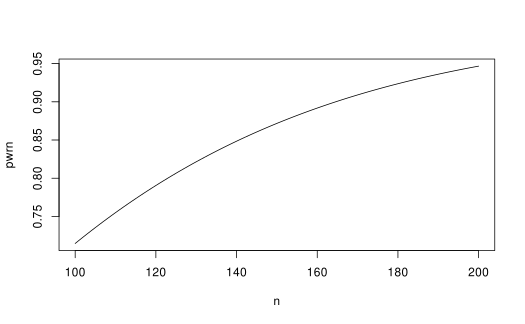
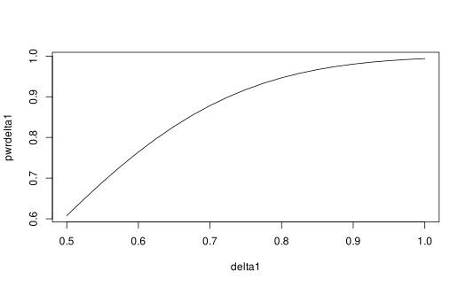

# Two-sample normal sample size

## Introduction

Limited support is provided for 2-sample design with a normally
distributed random variable as the outcome. Users are encouraged to look
at guidance such as in Jennison and Turnbull (2000). We provide a tool
where for a large sample case where a reasonable estimate of standard
deviation is available, a reasonable sample size can be computed based
straightforward distribution theory outlined below.

## The problem considered

The overall sample size notation used for **gsDesign** is to consider a
standardized effect size parameter which is referred to as \\\theta\\ in
Jennison and Turnbull (2000). We begin with the 2-sample normal problem
where we assume a possibly different standard deviation in each
treatment group. For \\j = 1, 2\\, we let \\X\_{j, i}\\, \\i = 1, 2,
\ldots n_j\\ represent independent and identically distributed
observations following a normal distribution with mean \\\mu_j\\ and
standard deviation \\\sigma_j\\. The natural parameter for comparing the
two distributions is

\\\delta = \mu_2 - \mu_1\\

and we wish to test if \\\delta \> 0\\ in a one-sided testing scenario
to test for superiority of treatment 2 over treatment 1. We could also
consider testing, say, \\\delta \> \delta_0\\ for a non-inferiority
scenario with \\\delta_0\<0\\ or **super superiority** if
\\\delta_0\>0\\. While normally a t-test would be used for this, for
large sample sizes this would be nearly equivalent to a Z-test defined
by:

\\Z=\frac{\bar X_2 - \bar X_1-\delta_0}{\sqrt{\sigma^2_2/n_2 +
\sigma_1^2/n_1}}\approx \frac{\bar X_2 - \bar X_1}{\sqrt{s^2_2/n_2 +
s_1^2/n_1}}=t\\ where \\\bar X_j\\ is the sample mean and \\s_j^2\\ is
the sample variance for group \\j=1,2\\. The far right hand side of this
is Welch’s t-test. For our examples we use this \\t\\-test and show that
the sample size computation based on the \\Z\\-test above works well for
the chosen problems.

## Sample size

Thus, \\n_2=rn/(1+r)\\, \\n_1=n/(1+r)\\ and when \\r=1\\ we have
\\n_1=n_2=n/2\\. Now that we have completed needed notation, those not
interested in the theory behind the sample size and power calculation
used may skip the rest of this section.

We let \\\sigma^2=(1+r)(\sigma_1^2+\sigma_2^2/r)\\ and define \\ \theta=
(\delta -\delta_0)/\sigma.\\ Under the given assumptions, \\Z \sim
\text{Normal}\left(\sqrt n\theta,1\right).\\ Under the null hypothesis
that \\\delta=\delta_0\\, we have \\Z\sim \text{Normal}(0,1)\\. Thus,
regardless of \\n\\ we have \\P_0\[Z\ge \Phi^{-1}(1-\alpha)\]=\alpha.\\
Under the alternate hypothesis that \\\delta=\delta_1\\ and we denote a
corresponding \\\theta_1\\. We define the type II error \\\beta\\ and
power \\1-\beta\\ by

\\ \begin{align} 1-\beta =& P_1\[Z\ge \Phi^{-1}(1-\alpha)\]\\ =&
P\[Z-\sqrt n\theta_1\ge \Phi^{-1}(1-\alpha)-\sqrt n\theta_1\]\\
=&\Phi(\Phi^{-1}(1-\alpha)-\sqrt n\theta_1)). \end{align}\\

If the power \\1-\beta\\ is fixed, we can invert this formula to compute
sample size with:

\\n=
\left(\frac{\Phi^{-1}(1-\beta)+\Phi^{-1}(1-\alpha)}{\theta_1}\right)^2.\\

For 2-sided testing, we simply substitute \\\alpha/2\\ for \\\alpha\\ in
the above two formulas.

## Examples

We consider two examples to check the above formulas
vs. [`nNormal()`](https://keaven.github.io/gsDesign/reference/nNormal.md).
We then confirm that the approximation is working well by simulating and
confirming that the power and Type I error approximations are useful.
Finally, we provide a simple group sequential design example.

### Sample size

We consider an example with \\\sigma_2=1.25\\, \\\sigma_1=1.6\\,
\\\delta=0.8\\ and \\\delta_0=0\\. We let the sample size ratio be 2
experimental group observations per control observation. We compute
sample size with
[`nNormal()`](https://keaven.github.io/gsDesign/reference/nNormal.md)
assuming one-sided Type I error \\\alpha=0.025\\ and 90% power
(\\1-\beta=0.9\\).

Checking using the sample size formula above, we have:

``` r
r <- 2
sigma <- sqrt((1 + r) * (1.6^2 + 1.25^2 / r))
theta <- 0.8 / sigma
((qnorm(.9) + qnorm(.975)) / theta)^2
#> [1] 164.5684
```

### Power

Now, assume we let the sample size be 200 and compute power under the
same scenario.

``` r
nNormal(delta1 = 0.8, sd = 1.6, sd2 = 1.25, alpha = 0.025, n = 200, ratio = 2)
#> [1] 0.9466825
```

From the power formula above, we duplicate this with:

``` r
pwr <- pnorm(qnorm(.975) - sqrt(200) * theta, lower.tail = FALSE)
pwr
#> [1] 0.9466825
```

If we want to plot power for a variety of sample sizes, we can input `n`
as a vector:

``` r
n <- 100:200
pwrn <- nNormal(delta1 = 0.8, sd = 1.6, sd2 = 1.25, alpha = 0.025, n = n, ratio = 2)
plot(n, pwrn, type = "l")
```



Alternatively, you could fix sample size at 200 and plot power under
different treatment effect assumptions:

``` r
delta1 <- seq(.5, 1, .025)
pwrdelta1 <- nNormal(delta1 = delta1, sd = 1.6, sd2 = 1.25, alpha = 0.025, n = 200, ratio = 2)
plot(delta1, pwrdelta1, type = "l")
```



### Verification with simulation

Rather than simulate individual observations, we will take advantage of
the fact that for \\j=1,2\\

\\\bar X_j\sim \text{Normal}(\mu_j,\sigma_j^2/n_j)\\

and

\\(n_j-1)s_j^2/\sigma_j^2=\sum\_{i=1}^{n_j} (X\_{ij}-\bar X_j)/\sigma^2
\sim \chi ^2\_{n_j-1}\\

are independent. Thus, we can simulate trial power with \\n=200\\ 1
million times with a t-statistic with unequal variances quickly as
follows under the alternate hypothesis:

``` r
nsim <- 1000000
delta <- 0.8
sd1 <- 1.6
sd2 <- 1.25
n1 <- 67
n2 <- 133
deltahat <- rnorm(n = nsim, mean = delta, sd = sd1 / sqrt(n1)) -
  rnorm(n = nsim, mean = 0, sd = sd2 / sqrt(n2))
s <- sqrt(
  sd1^2 * rchisq(n = nsim, df = n1 - 1) / (n1 - 1) / n1 +
    sd2^2 * rchisq(n = nsim, df = n2 - 1) / (n2 - 1) / n2
)
z <- deltahat / s
mean(z >= qnorm(.975))
#> [1] 0.946201
```

The standard error for this simulation power calculation is
approximately

``` r
sqrt(pwr * (1 - pwr) / nsim)
#> [1] 0.0002246659
```

suggesting we should be within less than about 0.001 if the actual
power, which suggests the normal power approximation is reasonable for
this scenario.

### Group sequential design

Now we derive a group sequential design under the above scenario. We
will largely use default parameters and show two methods. For the first,
we plug in the fixed sample size above as follows:

``` r
d <- gsDesign(
  k = 2,
  n.fix = nNormal(delta1 = 0.8, sd = 1.6, sd2 = 1.25, alpha = 0.025, beta = .1, ratio = 2),
  delta1 = 0.8
)
d |>
  gsBoundSummary(deltaname = "Mean difference") |>
  kable(row.names = FALSE)
```

| Analysis  | Value                           | Efficacy | Futility |
|:----------|:--------------------------------|---------:|---------:|
| IA 1: 50% | Z                               |   2.7500 |   0.4122 |
| N: 86     | p (1-sided)                     |   0.0030 |   0.3401 |
|           | ~Mean difference at bound       |   0.9399 |   0.1409 |
|           | P(Cross) if Mean difference=0   |   0.0030 |   0.6599 |
|           | P(Cross) if Mean difference=0.8 |   0.3412 |   0.0269 |
| Final     | Z                               |   1.9811 |   1.9811 |
| N: 172    | p (1-sided)                     |   0.0238 |   0.0238 |
|           | ~Mean difference at bound       |   0.4788 |   0.4788 |
|           | P(Cross) if Mean difference=0   |   0.0239 |   0.9761 |
|           | P(Cross) if Mean difference=0.8 |   0.9000 |   0.1000 |

A textual summary of the design is given by:

``` r
cat(summary(d))
```

Asymmetric two-sided group sequential design with non-binding futility
bound, 2 analyses, sample size 172, 90 percent power, 2.5 percent
(1-sided) Type I error. Efficacy bounds derived using a
Hwang-Shih-DeCani spending function with gamma = -4. Futility bounds
derived using a Hwang-Shih-DeCani spending function with gamma = -2.

We can get the same answer by plugging in the standardized effect size
we computed above:

``` r
gsDesign(
  k = 2,
  delta = theta,
  delta1 = 0.8
) |>
  gsBoundSummary(deltaname = "Mean difference") |>
  kable(row.names = FALSE)
```

| Analysis  | Value                           | Efficacy | Futility |
|:----------|:--------------------------------|---------:|---------:|
| IA 1: 50% | Z                               |   2.7500 |   0.4122 |
| N: 86     | p (1-sided)                     |   0.0030 |   0.3401 |
|           | ~Mean difference at bound       |   0.9399 |   0.1409 |
|           | P(Cross) if Mean difference=0   |   0.0030 |   0.6599 |
|           | P(Cross) if Mean difference=0.8 |   0.3412 |   0.0269 |
| Final     | Z                               |   1.9811 |   1.9811 |
| N: 172    | p (1-sided)                     |   0.0238 |   0.0238 |
|           | ~Mean difference at bound       |   0.4788 |   0.4788 |
|           | P(Cross) if Mean difference=0   |   0.0239 |   0.9761 |
|           | P(Cross) if Mean difference=0.8 |   0.9000 |   0.1000 |

We leave it to the reader to verify the properties of the above design
using simulation as in the fixed design example.

## References

Jennison, Christopher, and Bruce W. Turnbull. 2000. *Group Sequential
Methods with Applications to Clinical Trials*. Boca Raton, FL: Chapman;
Hall/CRC.
